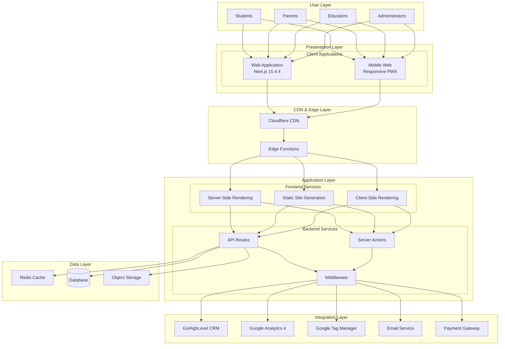
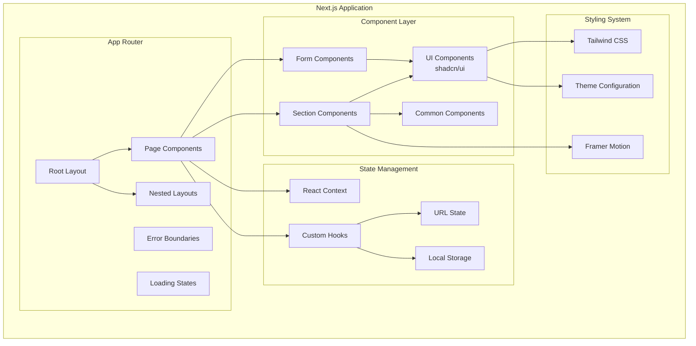
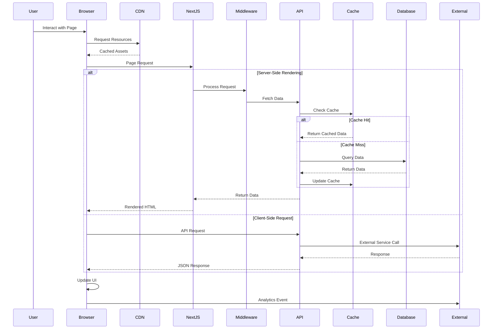
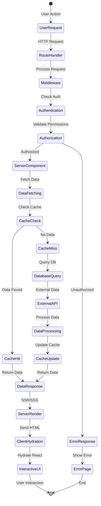
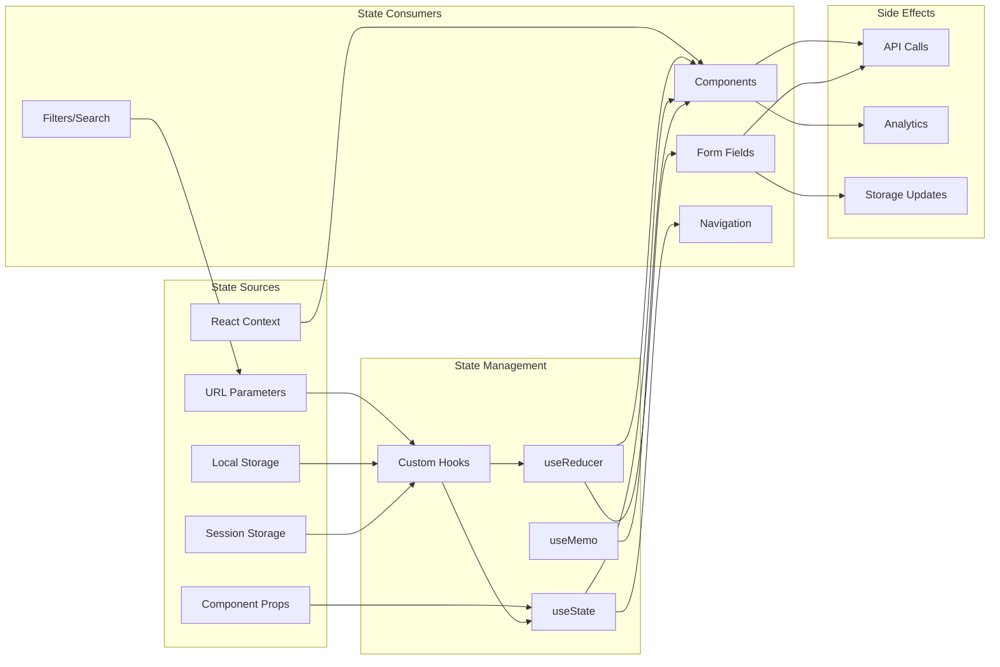
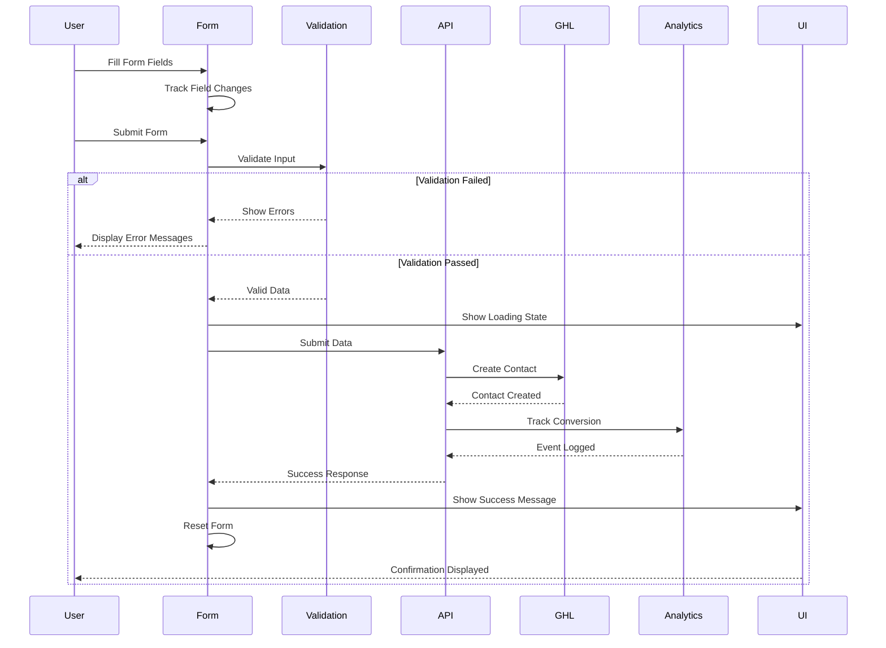

# Architecture Overview

## System Design Diagrams

### High-Level System Architecture



### Frontend Architecture Diagram



### Data Flow Architecture



## Component Hierarchy

### Application Structure

```
american-faith-academy/
├── src/
│   ├── app/                          # Next.js App Router
│   │   ├── layout.tsx               # Root layout
│   │   ├── page.tsx                 # Home page
│   │   ├── globals.css              # Global styles
│   │   ├── (marketing)/             # Marketing pages group
│   │   │   ├── about/
│   │   │   │   └── page.tsx
│   │   │   ├── academics/
│   │   │   │   └── page.tsx
│   │   │   ├── admissions/
│   │   │   │   └── page.tsx
│   │   │   └── contact/
│   │   │       └── page.tsx
│   │   ├── soaring-centers/         # Feature section
│   │   │   ├── layout.tsx           # Custom star animation layout
│   │   │   └── page.tsx
│   │   └── api/                     # API routes
│   │       ├── contact/
│   │       ├── ghl/
│   │       └── analytics/
│   │
│   ├── components/                   # Component library
│   │   ├── ui/                      # Base UI components
│   │   │   ├── button.tsx
│   │   │   ├── card.tsx
│   │   │   ├── dialog.tsx
│   │   │   ├── form.tsx
│   │   │   ├── input.tsx
│   │   │   ├── label.tsx
│   │   │   ├── select.tsx
│   │   │   ├── sheet.tsx
│   │   │   ├── textarea.tsx
│   │   │   ├── animated-section.tsx
│   │   │   └── lazy-animated-section.tsx
│   │   │
│   │   ├── layout/                  # Layout components
│   │   │   ├── Navigation.tsx       # Main navigation
│   │   │   ├── Footer.tsx          # Site footer
│   │   │   └── MobileNav.tsx       # Mobile navigation
│   │   │
│   │   ├── sections/                # Page sections
│   │   │   ├── HeroSection.tsx
│   │   │   ├── SOARFramework.tsx
│   │   │   ├── InnovationSection.tsx
│   │   │   ├── AITechnologySection.tsx
│   │   │   ├── LearningModelsSection.tsx
│   │   │   ├── EducatorSection.tsx
│   │   │   ├── TestimonialsSection.tsx
│   │   │   ├── PartnershipSection.tsx
│   │   │   └── CTASection.tsx
│   │   │
│   │   ├── forms/                   # Form components
│   │   │   ├── ContactForm.tsx
│   │   │   ├── ApplicationForm.tsx
│   │   │   └── NewsletterForm.tsx
│   │   │
│   │   ├── soaring-centers/         # Feature-specific components
│   │   │   └── components/
│   │   │       └── OptimizedStarBackground.tsx
│   │   │
│   │   └── PerformanceMonitor.tsx  # Performance tracking
│   │
│   ├── lib/                         # Utilities and helpers
│   │   ├── utils.ts                # Utility functions
│   │   ├── constants.ts            # App constants
│   │   └── animations.ts           # Animation configs
│   │
│   ├── hooks/                       # Custom React hooks
│   │   ├── useScrollProgress.ts
│   │   ├── useIntersection.ts
│   │   └── useMediaQuery.ts
│   │
│   ├── styles/                      # Additional styles
│   │   └── animations.css
│   │
│   └── types/                       # TypeScript types
│       ├── global.d.ts
│       └── api.ts
│
├── public/                          # Static assets
│   ├── images/
│   ├── fonts/
│   └── afa-logo.png
│
├── docs/                           # Documentation
│   └── ARCHITECTURE.md
│
└── config files...                 # Configuration
```

### Component Dependency Graph

```mermaid
graph TD
    subgraph "Page Components"
        HomePage[Home Page]
        AboutPage[About Page]
        AcademicsPage[Academics Page]
        AdmissionsPage[Admissions Page]
        SoaringPage[Soaring Centers Page]
        ContactPage[Contact Page]
    end
    
    subgraph "Layout Components"
        RootLayout[Root Layout]
        Navigation[Navigation]
        Footer[Footer]
        MobileNav[Mobile Navigation]
    end
    
    subgraph "Section Components"
        Hero[Hero Section]
        SOAR[SOAR Framework]
        Innovation[Innovation Section]
        AITech[AI Technology]
        Learning[Learning Models]
        Educator[Educator Section]
        Testimonials[Testimonials]
        Partnership[Partnership]
        CTA[CTA Section]
    end
    
    subgraph "UI Components"
        Button[Button]
        Card[Card]
        Form[Form]
        Dialog[Dialog]
        AnimatedSection[Animated Section]
    end
    
    subgraph "Utilities"
        Utils[Utils]
        Hooks[Custom Hooks]
        Constants[Constants]
    end
    
    HomePage --> Hero & SOAR & Innovation & AITech & Learning
    HomePage --> Educator & Testimonials & Partnership & CTA
    AboutPage --> AnimatedSection
    SoaringPage --> AnimatedSection
    
    RootLayout --> Navigation & Footer
    Navigation --> Button & MobileNav
    
    Hero --> AnimatedSection & Button
    SOAR --> Card & AnimatedSection
    AITech --> Card
    Partnership --> Card & Button
    
    AnimatedSection --> Utils & Hooks
    Card --> Utils
    Form --> Button & Utils
```



## Data Flow Documentation

### Request/Response Flow



### State Management Flow



### Form Submission Flow



## Integration Points

### GoHighLevel (GHL) CRM Integration

```yaml
Integration: GoHighLevel CRM
Type: REST API
Authentication: API Key (Bearer Token)
Base URL: https://api.gohighlevel.com/v1

Endpoints:
  Contacts:
    - POST /contacts: Create new contact
    - GET /contacts/{id}: Get contact details
    - PUT /contacts/{id}: Update contact
    - DELETE /contacts/{id}: Delete contact
  
  Forms:
    - POST /forms/submit: Submit form data
    - GET /forms/{id}/submissions: Get form submissions
  
  Workflows:
    - POST /workflows/{id}/trigger: Trigger workflow
    - GET /workflows: List workflows
  
  Custom Fields:
    - GET /custom-fields: List custom fields
    - POST /custom-values: Set custom field values

Data Mapping:
  Contact Form -> GHL Contact:
    - firstName: contact.first_name
    - lastName: contact.last_name
    - email: contact.email
    - phone: contact.phone
    - source: "Website - Contact Form"
    - tags: ["website-lead", "contact-form"]
    
  Application Form -> GHL Opportunity:
    - contact_id: contact.id
    - pipeline_id: "enrollment_pipeline"
    - stage_id: "new_application"
    - monetary_value: tuition_amount
    - custom_fields:
        - grade_level
        - start_date
        - program_type

Webhooks:
  - contact.created
  - contact.updated
  - opportunity.stage_changed
  - workflow.completed

Rate Limits:
  - 120 requests per minute
  - 10,000 requests per day

Error Handling:
  - Retry with exponential backoff
  - Queue failed requests
  - Notify admin on persistent failures
```

### Analytics Integration

```yaml
Google Analytics 4 (GA4):
  Measurement ID: G-XXXXXXXXXX
  
  Events:
    Page View:
      - page_location
      - page_title
      - page_referrer
    
    Form Submission:
      - form_name: "contact" | "application" | "newsletter"
      - form_destination: URL
      - submission_value: monetary value
    
    CTA Click:
      - cta_text: button text
      - cta_location: section name
      - cta_destination: target URL
    
    Scroll Depth:
      - percent_scrolled: 25 | 50 | 75 | 90
      - page_section: section identifier
    
    Video Engagement:
      - video_title
      - video_percent: 0 | 25 | 50 | 75 | 100
      - video_duration
    
    Download:
      - file_name
      - file_type: "pdf" | "doc" | "xlsx"
      - download_section

  Enhanced Ecommerce:
    - view_item: program details viewed
    - add_to_cart: application started
    - begin_checkout: application form opened
    - purchase: application submitted

  User Properties:
    - user_type: "parent" | "student" | "educator"
    - enrollment_status: "prospect" | "applicant" | "enrolled"
    - program_interest: program types
    - preferred_start_date

Google Tag Manager (GTM):
  Container ID: GTM-XXXXXXX
  
  Tags:
    - GA4 Configuration Tag
    - GA4 Event Tags (all events above)
    - Facebook Pixel
    - LinkedIn Insight Tag
    - Google Ads Conversion Tracking
    - Microsoft Clarity
  
  Triggers:
    - All Pages
    - Form Submit Success
    - CTA Clicks (RegEx match)
    - Scroll Thresholds
    - Video Milestones
    - External Link Clicks
    - File Downloads
  
  Variables:
    - Click Text
    - Click URL
    - Form ID
    - Scroll Depth Threshold
    - Video Title
    - Page Type
    - User Login Status

Data Layer Structure:
  window.dataLayer = [{
    event: 'event_name',
    event_category: 'category',
    event_label: 'label',
    event_value: numeric_value,
    custom_parameter: 'value',
    user_properties: {
      property_name: 'value'
    },
    ecommerce: {
      items: [{
        item_id: 'SKU',
        item_name: 'Program Name',
        item_category: 'Category',
        price: 1000.00
      }]
    }
  }]
```

### Email Service Integration

```yaml
Email Service: [SendGrid/Mailgun/Amazon SES]
Authentication: API Key
Environment Variables:
  - EMAIL_API_KEY
  - EMAIL_FROM_ADDRESS
  - EMAIL_FROM_NAME

Email Templates:
  Contact Form Notification:
    - To: admin@americanfaithacademy.org
    - Subject: New Contact Form Submission
    - Variables:
        - name
        - email
        - phone
        - message
        - submission_date
        - source_page
  
  Contact Form Confirmation:
    - To: {user_email}
    - Subject: Thank you for contacting American Faith Academy
    - Variables:
        - first_name
        - inquiry_type
        - next_steps
  
  Application Received:
    - To: {user_email}
    - CC: admissions@americanfaithacademy.org
    - Subject: Application Received - American Faith Academy
    - Variables:
        - student_name
        - grade_level
        - application_id
        - next_steps
        - timeline
  
  Newsletter Welcome:
    - To: {user_email}
    - Subject: Welcome to the AFA Community
    - Variables:
        - first_name
        - subscription_preferences
        - resources_link

Email Workflows:
  1. Contact Form Submission:
     - Send notification to admin (immediate)
     - Send confirmation to user (immediate)
     - Add to CRM (immediate)
     - Follow-up email (24 hours)
  
  2. Application Submission:
     - Send confirmation to family (immediate)
     - Notify admissions team (immediate)
     - Create CRM opportunity (immediate)
     - Schedule follow-up sequence (automated)

Error Handling:
  - Retry failed sends (3 attempts)
  - Log failures to error tracking
  - Fallback to backup service
  - Queue for manual review
```

### Payment Gateway Integration

```yaml
Payment Gateway: [Stripe/PayPal/Square]
Integration Type: Embedded Checkout
Authentication: Secret Key + Webhook Secret

Payment Flows:
  Application Fee:
    - Amount: $100
    - Type: One-time payment
    - Metadata:
        - application_id
        - student_name
        - grade_level
        - academic_year
  
  Tuition Deposit:
    - Amount: Variable
    - Type: One-time payment
    - Refundable: Partial
    - Metadata:
        - enrollment_id
        - payment_plan
        - due_date
  
  Tuition Payments:
    - Amount: Variable
    - Type: Recurring/One-time
    - Schedule: Monthly/Semester/Annual
    - Metadata:
        - student_id
        - payment_period
        - payment_plan_id

Webhook Events:
  - payment_intent.succeeded
  - payment_intent.failed
  - customer.subscription.created
  - customer.subscription.updated
  - invoice.payment_succeeded
  - invoice.payment_failed

Security:
  - PCI DSS Compliance
  - Tokenization for card storage
  - 3D Secure authentication
  - Webhook signature verification
```

## Decision Records (ADRs)

### ADR-001: Selection of Next.js 15 with App Router

**Date**: 2024-01-15  
**Status**: Accepted  
**Context**: 
- Need for a modern React framework with excellent performance
- Requirement for SEO optimization and fast page loads
- Need for flexible rendering strategies (SSR, SSG, ISR)
- Desire for improved developer experience

**Decision**: 
Adopt Next.js 15 with the App Router architecture instead of the Pages Router or other frameworks like Gatsby or Remix.

**Consequences**:
- **Positive**:
  - React Server Components reduce client-side JavaScript
  - Nested layouts improve code organization
  - Streaming SSR improves perceived performance
  - Built-in optimizations (image, font, script)
  - Excellent Vercel integration for deployment
  
- **Negative**:
  - Learning curve for developers new to App Router
  - Some third-party libraries need updates for RSC
  - More complex mental model than Pages Router
  
- **Neutral**:
  - Requires React 18+ features
  - Different patterns from traditional React apps

### ADR-002: Tailwind CSS as Primary Styling Solution

**Date**: 2024-01-20  
**Status**: Accepted  
**Context**:
- Need for consistent design system
- Requirement for responsive design
- Goal to minimize CSS bundle size
- Team preference for utility-first CSS

**Decision**:
Use Tailwind CSS v3 with custom configuration for all styling needs, supplemented by CSS modules for complex animations.

**Consequences**:
- **Positive**:
  - Consistent spacing and design tokens
  - Rapid prototyping and development
  - Excellent responsive utilities
  - JIT compiler produces minimal CSS
  - Great IDE support with IntelliSense
  
- **Negative**:
  - Verbose HTML with many classes
  - Learning curve for utility class names
  - Harder to create truly unique designs
  
- **Neutral**:
  - Requires PostCSS configuration
  - Different from traditional CSS approaches

### ADR-003: Framer Motion for Animations

**Date**: 2024-02-01  
**Status**: Accepted  
**Context**:
- Need for performant scroll-triggered animations
- Requirement for smooth page transitions
- Desire for declarative animation API
- Goal to enhance user experience without sacrificing performance

**Decision**:
Implement Framer Motion for all animations, with lazy loading for below-fold animated components.

**Consequences**:
- **Positive**:
  - Excellent performance with GPU acceleration
  - Declarative, easy-to-understand API
  - Great gesture and drag support
  - Built-in accessibility features
  - SSR compatible
  
- **Negative**:
  - Adds ~50KB to bundle (mitigated by lazy loading)
  - Can cause layout thrashing if misused
  - Learning curve for complex animations
  
- **Neutral**:
  - Requires careful performance monitoring
  - Different from CSS animations approach

### ADR-004: shadcn/ui for Component Library

**Date**: 2024-02-15  
**Status**: Accepted  
**Context**:
- Need for accessible UI components
- Requirement for full customization control
- Desire to avoid vendor lock-in
- Goal to maintain small bundle size

**Decision**:
Use shadcn/ui components built on Radix UI primitives, copying components directly into the codebase.

**Consequences**:
- **Positive**:
  - Full control over component code
  - Accessible by default (WCAG compliant)
  - No external dependency for UI library
  - Perfectly integrated with Tailwind
  - Type-safe with TypeScript
  
- **Negative**:
  - No automatic updates for components
  - More initial setup than npm packages
  - Need to maintain component code
  
- **Neutral**:
  - Components live in project codebase
  - Different from traditional component libraries

### ADR-005: Static Generation with ISR Strategy

**Date**: 2024-02-20  
**Status**: Accepted  
**Context**:
- Need for optimal SEO and performance
- Requirement for some dynamic content
- Goal to minimize server costs
- Desire for best user experience

**Decision**:
Use Static Site Generation (SSG) for marketing pages with Incremental Static Regeneration (ISR) for semi-dynamic content.

**Consequences**:
- **Positive**:
  - Fastest possible page loads
  - Excellent SEO performance
  - Reduced server load
  - CDN-friendly architecture
  - Cost-effective hosting
  
- **Negative**:
  - Build time increases with page count
  - More complex deployment pipeline
  - Cache invalidation considerations
  
- **Neutral**:
  - Requires careful planning of data freshness
  - Different from traditional dynamic sites

### ADR-006: GoHighLevel as CRM Platform

**Date**: 2024-03-01  
**Status**: Accepted  
**Context**:
- Need for education-focused CRM
- Requirement for marketing automation
- Goal to streamline admissions process
- Existing institutional investment in GHL

**Decision**:
Integrate with GoHighLevel for all CRM, marketing automation, and enrollment management needs.

**Consequences**:
- **Positive**:
  - Purpose-built for education sector
  - Comprehensive automation capabilities
  - Unified platform for multiple needs
  - Good API for integration
  
- **Negative**:
  - Vendor lock-in for CRM data
  - Monthly subscription costs
  - Limited customization options
  
- **Neutral**:
  - Requires API integration work
  - Team needs GHL training

### ADR-007: Performance Monitoring Strategy

**Date**: 2024-03-10  
**Status**: Accepted  
**Context**:
- Need to ensure excellent user experience
- Requirement for performance metrics
- Goal to identify bottlenecks early
- Desire for data-driven optimization

**Decision**:
Implement custom Web Vitals monitoring with real-time reporting to Google Analytics.

**Consequences**:
- **Positive**:
  - Real user monitoring (RUM) data
  - Integrated with existing analytics
  - No additional service costs
  - Full control over metrics
  
- **Negative**:
  - Need to build monitoring dashboard
  - More complex than third-party solutions
  - Requires ongoing maintenance
  
- **Neutral**:
  - Custom implementation required
  - Need to define performance budgets

### ADR-008: Git Workflow and Branching Strategy

**Date**: 2024-03-15  
**Status**: Accepted  
**Context**:
- Need for safe deployment process
- Requirement for code review
- Goal to enable parallel development
- Desire for clear version history

**Decision**:
Adopt GitHub Flow with protected main branch, requiring PR reviews and passing CI checks.

**Consequences**:
- **Positive**:
  - Simple, easy-to-understand workflow
  - Forces code review
  - Maintains stable main branch
  - Clear deployment path
  
- **Negative**:
  - Can slow down urgent fixes
  - Requires discipline from team
  - Need robust CI/CD pipeline
  
- **Neutral**:
  - Different from GitFlow
  - Requires branch protection rules