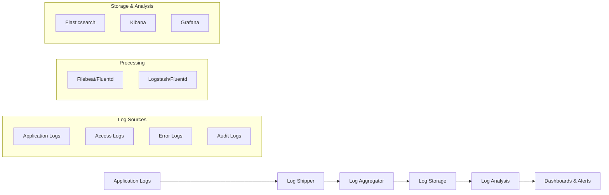

# Monitoring & Alerts

## Health Check Endpoints

### Overview

Health check endpoints are critical HTTP endpoints that allow monitoring systems, load balancers, and operations teams to verify that the American Faith Academy application is running correctly. These endpoints provide real-time information about system health, dependencies, and performance.

### Basic Health Check

#### Endpoint: `/api/health`

The primary health check endpoint that confirms the application is responsive.

```typescript
// Implementation: app/api/health/route.ts
import { NextResponse } from 'next/server';

export async function GET() {
  try {
    const healthStatus = {
      status: 'healthy',
      timestamp: new Date().toISOString(),
      service: 'american-faith-academy-web',
      version: process.env.APP_VERSION || '1.0.0',
      environment: process.env.NODE_ENV,
      uptime: process.uptime(),
    };

    return NextResponse.json(healthStatus, { status: 200 });
  } catch (error) {
    return NextResponse.json(
      {
        status: 'unhealthy',
        timestamp: new Date().toISOString(),
        error: 'Health check failed',
      },
      { status: 503 }
    );
  }
}
```

**Expected Response (Healthy):**
```json
{
  "status": "healthy",
  "timestamp": "2024-01-29T10:30:00.000Z",
  "service": "american-faith-academy-web",
  "version": "1.0.0",
  "environment": "production",
  "uptime": 86400
}
```

**Monitoring Configuration:**
```yaml
# Monitor configuration
check_interval: 30s
timeout: 5s
healthy_threshold: 2
unhealthy_threshold: 3
expected_status: 200
expected_response_contains: "healthy"
```

### Detailed Health Check

#### Endpoint: `/api/health/detailed`

Comprehensive health check that validates all system components.

```typescript
// Implementation: app/api/health/detailed/route.ts
import { NextResponse } from 'next/server';
import { checkDatabase } from '@/lib/health/database';
import { checkRedis } from '@/lib/health/redis';
import { checkExternalAPIs } from '@/lib/health/external';

export async function GET(request: Request) {
  // Verify authentication for detailed health info
  const authHeader = request.headers.get('authorization');
  if (authHeader !== `Bearer ${process.env.MONITORING_TOKEN}`) {
    return NextResponse.json({ error: 'Unauthorized' }, { status: 401 });
  }

  const checks = await Promise.allSettled([
    checkDatabase(),
    checkRedis(),
    checkExternalAPIs(),
  ]);

  const components = {
    database: checks[0].status === 'fulfilled' ? checks[0].value : { status: 'unhealthy', error: checks[0].reason },
    cache: checks[1].status === 'fulfilled' ? checks[1].value : { status: 'unhealthy', error: checks[1].reason },
    external_apis: checks[2].status === 'fulfilled' ? checks[2].value : { status: 'unhealthy', error: checks[2].reason },
  };

  const overallStatus = Object.values(components).every(c => c.status === 'healthy') 
    ? 'healthy' 
    : 'degraded';

  return NextResponse.json({
    status: overallStatus,
    timestamp: new Date().toISOString(),
    components,
    metrics: {
      memory_usage_mb: process.memoryUsage().heapUsed / 1024 / 1024,
      cpu_usage: process.cpuUsage(),
      active_connections: await getActiveConnections(),
    },
  });
}

// Health check implementations
async function checkDatabase() {
  const start = Date.now();
  try {
    await db.query('SELECT 1');
    return {
      status: 'healthy',
      latency_ms: Date.now() - start,
      connection_pool: {
        active: db.pool.activeConnections,
        idle: db.pool.idleConnections,
        total: db.pool.totalConnections,
      },
    };
  } catch (error) {
    return {
      status: 'unhealthy',
      error: error.message,
      latency_ms: Date.now() - start,
    };
  }
}
```

### Dependency Health Checks

#### Endpoint: `/api/health/dependencies`

Checks the health of all external dependencies.

```typescript
// Implementation: app/api/health/dependencies/route.ts
interface DependencyCheck {
  name: string;
  status: 'operational' | 'degraded' | 'down';
  latency_ms: number;
  last_checked: string;
  details?: any;
}

const dependencies: DependencyCheck[] = [
  {
    name: 'gohighlevel_api',
    endpoint: 'https://api.gohighlevel.com/v1/health',
    timeout: 5000,
  },
  {
    name: 'sendgrid_api',
    endpoint: 'https://api.sendgrid.com/v3/health',
    timeout: 3000,
  },
  {
    name: 'stripe_api',
    endpoint: 'https://api.stripe.com/v1/health',
    timeout: 5000,
  },
  {
    name: 'cloudflare_cdn',
    endpoint: 'https://www.cloudflarestatus.com/api/v2/status.json',
    timeout: 2000,
  },
];

export async function GET() {
  const results = await Promise.all(
    dependencies.map(async (dep) => {
      const start = Date.now();
      try {
        const response = await fetch(dep.endpoint, {
          signal: AbortSignal.timeout(dep.timeout),
        });
        
        return {
          name: dep.name,
          status: response.ok ? 'operational' : 'degraded',
          latency_ms: Date.now() - start,
          last_checked: new Date().toISOString(),
          status_code: response.status,
        };
      } catch (error) {
        return {
          name: dep.name,
          status: 'down',
          latency_ms: Date.now() - start,
          last_checked: new Date().toISOString(),
          error: error.message,
        };
      }
    })
  );

  const overallStatus = results.every(r => r.status === 'operational')
    ? 'operational'
    : results.some(r => r.status === 'down')
    ? 'partial_outage'
    : 'degraded';

  return NextResponse.json({
    status: overallStatus,
    timestamp: new Date().toISOString(),
    dependencies: results,
  });
}
```

### Readiness and Liveness Probes

#### Kubernetes-style Probes

```typescript
// Liveness Probe: /api/health/live
// Checks if the application is running
export async function GET() {
  return NextResponse.json({ status: 'alive' }, { status: 200 });
}

// Readiness Probe: /api/health/ready
// Checks if the application is ready to serve traffic
export async function GET() {
  try {
    // Check critical dependencies
    await Promise.all([
      checkDatabaseConnection(),
      checkCacheConnection(),
    ]);

    return NextResponse.json({ status: 'ready' }, { status: 200 });
  } catch (error) {
    return NextResponse.json(
      { status: 'not_ready', reason: error.message },
      { status: 503 }
    );
  }
}
```

### Health Check Dashboard

```typescript
// Simple health dashboard implementation
export function HealthDashboard() {
  const [health, setHealth] = useState(null);
  const [dependencies, setDependencies] = useState([]);

  useEffect(() => {
    const fetchHealth = async () => {
      try {
        const [healthRes, depsRes] = await Promise.all([
          fetch('/api/health/detailed'),
          fetch('/api/health/dependencies'),
        ]);
        
        setHealth(await healthRes.json());
        setDependencies(await depsRes.json());
      } catch (error) {
        console.error('Failed to fetch health data:', error);
      }
    };

    fetchHealth();
    const interval = setInterval(fetchHealth, 30000); // Update every 30s

    return () => clearInterval(interval);
  }, []);

  return (
    <div className="p-6">
      <h1 className="text-2xl font-bold mb-6">System Health Dashboard</h1>
      
      {/* Overall Status */}
      <div className={`p-4 rounded-lg ${
        health?.status === 'healthy' ? 'bg-green-100' : 'bg-red-100'
      }`}>
        <h2 className="text-lg font-semibold">
          Status: {health?.status || 'Loading...'}
        </h2>
        <p className="text-sm text-gray-600">
          Last updated: {health?.timestamp}
        </p>
      </div>

      {/* Component Status */}
      <div className="grid grid-cols-3 gap-4 mt-6">
        {Object.entries(health?.components || {}).map(([name, component]) => (
          <div key={name} className="border rounded-lg p-4">
            <h3 className="font-semibold">{name}</h3>
            <p className={`text-sm ${
              component.status === 'healthy' ? 'text-green-600' : 'text-red-600'
            }`}>
              {component.status}
            </p>
            {component.latency_ms && (
              <p className="text-xs text-gray-500">
                Latency: {component.latency_ms}ms
              </p>
            )}
          </div>
        ))}
      </div>
    </div>
  );
}
```

## Log Aggregation Setup

### Logging Architecture



### Application Logging Configuration

#### Winston Logger Setup

```typescript
// lib/logger.ts
import winston from 'winston';
import { LoggingWinston } from '@google-cloud/logging-winston';

// Define log levels
const levels = {
  error: 0,
  warn: 1,
  info: 2,
  http: 3,
  debug: 4,
};

// Define log colors
const colors = {
  error: 'red',
  warn: 'yellow',
  info: 'green',
  http: 'magenta',
  debug: 'white',
};

winston.addColors(colors);

// Create logger instance
const logger = winston.createLogger({
  level: process.env.LOG_LEVEL || 'info',
  levels,
  format: winston.format.combine(
    winston.format.timestamp({ format: 'YYYY-MM-DD HH:mm:ss:ms' }),
    winston.format.errors({ stack: true }),
    winston.format.json(),
  ),
  defaultMeta: {
    service: 'afa-web',
    environment: process.env.NODE_ENV,
    version: process.env.APP_VERSION,
  },
  transports: [
    // Console transport for development
    new winston.transports.Console({
      format: winston.format.combine(
        winston.format.colorize({ all: true }),
        winston.format.printf(
          (info) => `${info.timestamp} ${info.level}: ${info.message}`,
        ),
      ),
    }),
    
    // File transports for production
    new winston.transports.File({
      filename: 'logs/error.log',
      level: 'error',
      maxsize: 10485760, // 10MB
      maxFiles: 5,
    }),
    new winston.transports.File({
      filename: 'logs/combined.log',
      maxsize: 10485760, // 10MB
      maxFiles: 5,
    }),
  ],
});

// Add cloud logging in production
if (process.env.NODE_ENV === 'production') {
  logger.add(new LoggingWinston({
    projectId: process.env.GCP_PROJECT_ID,
    keyFilename: process.env.GCP_KEY_FILE,
  }));
}

export default logger;
```

#### Structured Logging

```typescript
// lib/structured-logger.ts
interface LogContext {
  userId?: string;
  sessionId?: string;
  requestId?: string;
  action?: string;
  metadata?: Record<string, any>;
}

class StructuredLogger {
  private context: LogContext = {};

  setContext(context: LogContext) {
    this.context = { ...this.context, ...context };
  }

  clearContext() {
    this.context = {};
  }

  private formatMessage(level: string, message: string, meta?: any) {
    return {
      timestamp: new Date().toISOString(),
      level,
      message,
      ...this.context,
      ...meta,
    };
  }

  info(message: string, meta?: any) {
    const log = this.formatMessage('info', message, meta);
    logger.info(log);
  }

  error(message: string, error?: Error, meta?: any) {
    const log = this.formatMessage('error', message, {
      ...meta,
      error: {
        message: error?.message,
        stack: error?.stack,
        name: error?.name,
      },
    });
    logger.error(log);
  }

  warn(message: string, meta?: any) {
    const log = this.formatMessage('warn', message, meta);
    logger.warn(log);
  }

  debug(message: string, meta?: any) {
    const log = this.formatMessage('debug', message, meta);
    logger.debug(log);
  }

  // Audit logging
  audit(action: string, resource: string, result: 'success' | 'failure', meta?: any) {
    const log = this.formatMessage('info', `Audit: ${action} on ${resource}`, {
      audit: true,
      action,
      resource,
      result,
      ...meta,
    });
    logger.info(log);
  }

  // Performance logging
  performance(operation: string, duration: number, meta?: any) {
    const log = this.formatMessage('info', `Performance: ${operation}`, {
      performance: true,
      operation,
      duration_ms: duration,
      ...meta,
    });
    logger.info(log);
  }
}

export const structuredLogger = new StructuredLogger();
```

#### Request Logging Middleware

```typescript
// middleware/logging.ts
import { NextRequest, NextResponse } from 'next/server';
import { nanoid } from 'nanoid';
import { structuredLogger } from '@/lib/structured-logger';

export function loggingMiddleware(request: NextRequest) {
  const requestId = nanoid();
  const startTime = Date.now();

  // Add request ID to headers
  const requestHeaders = new Headers(request.headers);
  requestHeaders.set('x-request-id', requestId);

  // Log request
  structuredLogger.setContext({ requestId });
  structuredLogger.info('Request received', {
    method: request.method,
    url: request.url,
    userAgent: request.headers.get('user-agent'),
    ip: request.headers.get('x-forwarded-for') || request.headers.get('x-real-ip'),
  });

  // Create response handler
  const response = NextResponse.next({
    request: {
      headers: requestHeaders,
    },
  });

  // Log response
  response.headers.set('x-request-id', requestId);
  
  // Log response time
  const duration = Date.now() - startTime;
  structuredLogger.performance(`${request.method} ${request.nextUrl.pathname}`, duration, {
    status: response.status,
  });

  return response;
}
```

### Log Aggregation Tools

#### ELK Stack Configuration

```yaml
# docker-compose.yml for ELK stack
version: '3.8'

services:
  elasticsearch:
    image: docker.elastic.co/elasticsearch/elasticsearch:8.11.0
    container_name: afa-elasticsearch
    environment:
      - discovery.type=single-node
      - "ES_JAVA_OPTS=-Xms512m -Xmx512m"
      - xpack.security.enabled=false
    ports:
      - "9200:9200"
    volumes:
      - elasticsearch-data:/usr/share/elasticsearch/data

  logstash:
    image: docker.elastic.co/logstash/logstash:8.11.0
    container_name: afa-logstash
    volumes:
      - ./logstash/config/logstash.yml:/usr/share/logstash/config/logstash.yml
      - ./logstash/pipeline:/usr/share/logstash/pipeline
    ports:
      - "5044:5044"
      - "5000:5000/tcp"
      - "5000:5000/udp"
    environment:
      LS_JAVA_OPTS: "-Xmx256m -Xms256m"
    depends_on:
      - elasticsearch

  kibana:
    image: docker.elastic.co/kibana/kibana:8.11.0
    container_name: afa-kibana
    ports:
      - "5601:5601"
    environment:
      ELASTICSEARCH_URL: http://elasticsearch:9200
      ELASTICSEARCH_HOSTS: '["http://elasticsearch:9200"]'
    depends_on:
      - elasticsearch

volumes:
  elasticsearch-data:
```

#### Logstash Pipeline Configuration

```ruby
# logstash/pipeline/logstash.conf
input {
  # Application logs via filebeat
  beats {
    port => 5044
  }
  
  # Direct TCP input for apps
  tcp {
    port => 5000
    codec => json_lines
  }
  
  # Syslog input
  syslog {
    port => 5514
    type => "syslog"
  }
}

filter {
  # Parse JSON logs
  if [message] =~ /^{.*}$/ {
    json {
      source => "message"
      target => "parsed"
    }
    
    mutate {
      replace => { "message" => "%{[parsed][message]}" }
    }
  }
  
  # Add GeoIP information
  if [ip] {
    geoip {
      source => "ip"
      target => "geoip"
    }
  }
  
  # Parse user agent
  if [userAgent] {
    useragent {
      source => "userAgent"
      target => "user_agent"
    }
  }
  
  # Extract custom fields
  if [parsed][userId] {
    mutate {
      add_field => { "user_id" => "%{[parsed][userId]}" }
    }
  }
  
  # Add timestamp
  date {
    match => [ "[parsed][timestamp]", "ISO8601" ]
    target => "@timestamp"
  }
}

output {
  # Send to Elasticsearch
  elasticsearch {
    hosts => ["elasticsearch:9200"]
    index => "afa-logs-%{+YYYY.MM.dd}"
  }
  
  # Send errors to separate index
  if [level] == "error" {
    elasticsearch {
      hosts => ["elasticsearch:9200"]
      index => "afa-errors-%{+YYYY.MM.dd}"
    }
  }
  
  # Send audit logs to separate index
  if [audit] == true {
    elasticsearch {
      hosts => ["elasticsearch:9200"]
      index => "afa-audit-%{+YYYY.MM.dd}"
    }
  }
}
```

#### Filebeat Configuration

```yaml
# filebeat.yml
filebeat.inputs:
  - type: log
    enabled: true
    paths:
      - /var/log/afa/*.log
      - /var/www/afa/logs/*.log
    json.keys_under_root: true
    json.add_error_key: true
    json.message_key: message
    fields:
      service: afa-web
      environment: production
    fields_under_root: true

  - type: container
    paths:
      - '/var/lib/docker/containers/*/*.log'
    processors:
      - add_docker_metadata:
          host: "unix:///var/run/docker.sock"

processors:
  - add_host_metadata:
      when.not.contains.tags: forwarded
  - add_docker_metadata: ~
  - add_kubernetes_metadata: ~

output.logstash:
  hosts: ["logstash:5044"]
  
logging.level: info
logging.to_files: true
logging.files:
  path: /var/log/filebeat
  name: filebeat
  keepfiles: 7
  permissions: 0640
```

### Cloud Logging Solutions

#### AWS CloudWatch Setup

```typescript
// lib/cloudwatch-logger.ts
import { CloudWatchLogsClient, PutLogEventsCommand } from '@aws-sdk/client-cloudwatch-logs';

const client = new CloudWatchLogsClient({
  region: process.env.AWS_REGION,
});

class CloudWatchLogger {
  private logGroupName = '/aws/afa/web';
  private logStreamName = `${process.env.NODE_ENV}-${new Date().toISOString().split('T')[0]}`;
  private sequenceToken?: string;

  async log(level: string, message: string, metadata?: any) {
    const logEvent = {
      message: JSON.stringify({
        level,
        message,
        metadata,
        timestamp: new Date().toISOString(),
      }),
      timestamp: Date.now(),
    };

    try {
      const command = new PutLogEventsCommand({
        logGroupName: this.logGroupName,
        logStreamName: this.logStreamName,
        logEvents: [logEvent],
        sequenceToken: this.sequenceToken,
      });

      const response = await client.send(command);
      this.sequenceToken = response.nextSequenceToken;
    } catch (error) {
      console.error('CloudWatch logging failed:', error);
    }
  }
}
```

## Performance Metrics

### Core Web Vitals Monitoring

```typescript
// lib/performance-monitor.ts
import { onCLS, onFID, onLCP, onFCP, onTTFB, onINP } from 'web-vitals';

interface PerformanceMetric {
  name: string;
  value: number;
  rating: 'good' | 'needs-improvement' | 'poor';
  delta: number;
  id: string;
}

class PerformanceMonitor {
  private metrics: Map<string, PerformanceMetric> = new Map();
  private metricsEndpoint = '/api/metrics';

  constructor() {
    this.initializeMetrics();
  }

  private initializeMetrics() {
    // Cumulative Layout Shift
    onCLS(this.handleMetric.bind(this));
    
    // First Input Delay (deprecated, use INP)
    onFID(this.handleMetric.bind(this));
    
    // Largest Contentful Paint
    onLCP(this.handleMetric.bind(this));
    
    // First Contentful Paint
    onFCP(this.handleMetric.bind(this));
    
    // Time to First Byte
    onTTFB(this.handleMetric.bind(this));
    
    // Interaction to Next Paint (replaces FID)
    onINP(this.handleMetric.bind(this));
  }

  private handleMetric(metric: PerformanceMetric) {
    this.metrics.set(metric.name, metric);
    
    // Log to console in development
    if (process.env.NODE_ENV === 'development') {
      console.log(`[${metric.name}] ${metric.value.toFixed(2)}ms (${metric.rating})`);
    }
    
    // Send to analytics
    this.sendToAnalytics(metric);
    
    // Send to monitoring endpoint
    this.sendToMonitoring(metric);
  }

  private sendToAnalytics(metric: PerformanceMetric) {
    if (typeof window !== 'undefined' && window.gtag) {
      window.gtag('event', 'web_vitals', {
        event_category: 'Performance',
        event_label: metric.name,
        value: Math.round(metric.value),
        metric_rating: metric.rating,
        non_interaction: true,
      });
    }
  }

  private async sendToMonitoring(metric: PerformanceMetric) {
    try {
      await fetch(this.metricsEndpoint, {
        method: 'POST',
        headers: { 'Content-Type': 'application/json' },
        body: JSON.stringify({
          metric: metric.name,
          value: metric.value,
          rating: metric.rating,
          timestamp: new Date().toISOString(),
          page: window.location.pathname,
          userAgent: navigator.userAgent,
        }),
      });
    } catch (error) {
      console.error('Failed to send metrics:', error);
    }
  }

  getMetrics() {
    return Array.from(this.metrics.values());
  }

  getMetric(name: string) {
    return this.metrics.get(name);
  }
}

export const performanceMonitor = new PerformanceMonitor();
```

### Custom Performance Metrics

```typescript
// lib/custom-metrics.ts
class CustomMetrics {
  private marks: Map<string, number> = new Map();
  private measures: Map<string, number> = new Map();

  // Mark a point in time
  mark(name: string) {
    this.marks.set(name, performance.now());
  }

  // Measure between two marks
  measure(name: string, startMark: string, endMark?: string) {
    const start = this.marks.get(startMark);
    if (!start) {
      console.warn(`Start mark '${startMark}' not found`);
      return;
    }

    const end = endMark ? this.marks.get(endMark) : performance.now();
    if (!end) {
      console.warn(`End mark '${endMark}' not found`);
      return;
    }

    const duration = end - start;
    this.measures.set(name, duration);

    // Log the measurement
    structuredLogger.performance(name, duration, {
      startMark,
      endMark,
    });

    return duration;
  }

  // Track API call performance
  async trackApiCall<T>(name: string, apiCall: () => Promise<T>): Promise<T> {
    const start = performance.now();
    let success = true;

    try {
      const result = await apiCall();
      return result;
    } catch (error) {
      success = false;
      throw error;
    } finally {
      const duration = performance.now() - start;
      
      structuredLogger.performance(`API: ${name}`, duration, {
        success,
        type: 'api_call',
      });

      // Send to monitoring
      this.sendMetric('api_performance', {
        endpoint: name,
        duration,
        success,
      });
    }
  }

  // Track component render performance
  trackComponentRender(componentName: string, phase: 'mount' | 'update', duration: number) {
    structuredLogger.performance(`Component: ${componentName}`, duration, {
      phase,
      type: 'component_render',
    });

    this.sendMetric('component_performance', {
      component: componentName,
      phase,
      duration,
    });
  }

  private async sendMetric(type: string, data: any) {
    try {
      await fetch('/api/metrics/custom', {
        method: 'POST',
        headers: { 'Content-Type': 'application/json' },
        body: JSON.stringify({
          type,
          data,
          timestamp: new Date().toISOString(),
        }),
      });
    } catch (error) {
      console.error('Failed to send custom metric:', error);
    }
  }
}

export const customMetrics = new CustomMetrics();
```

### Server-Side Performance Monitoring

```typescript
// lib/server-metrics.ts
import { performance } from 'perf_hooks';
import os from 'os';

interface ServerMetrics {
  timestamp: string;
  cpu: {
    usage: NodeJS.CpuUsage;
    loadAverage: number[];
    cores: number;
  };
  memory: {
    total: number;
    used: number;
    free: number;
    heapUsed: number;
    heapTotal: number;
    external: number;
    rss: number;
  };
  process: {
    uptime: number;
    pid: number;
    version: string;
  };
  custom?: Record<string, any>;
}

class ServerMetricsCollector {
  private metricsInterval?: NodeJS.Timeout;
  private metricsBuffer: ServerMetrics[] = [];
  private maxBufferSize = 100;

  startCollection(intervalMs: number = 60000) {
    this.metricsInterval = setInterval(() => {
      const metrics = this.collectMetrics();
      this.metricsBuffer.push(metrics);
      
      // Keep buffer size in check
      if (this.metricsBuffer.length > this.maxBufferSize) {
        this.metricsBuffer.shift();
      }
      
      // Send to monitoring service
      this.sendMetrics(metrics);
    }, intervalMs);
  }

  stopCollection() {
    if (this.metricsInterval) {
      clearInterval(this.metricsInterval);
    }
  }

  private collectMetrics(): ServerMetrics {
    const memoryUsage = process.memoryUsage();
    const cpuUsage = process.cpuUsage();

    return {
      timestamp: new Date().toISOString(),
      cpu: {
        usage: cpuUsage,
        loadAverage: os.loadavg(),
        cores: os.cpus().length,
      },
      memory: {
        total: os.totalmem(),
        used: os.totalmem() - os.freemem(),
        free: os.freemem(),
        heapUsed: memoryUsage.heapUsed,
        heapTotal: memoryUsage.heapTotal,
        external: memoryUsage.external,
        rss: memoryUsage.rss,
      },
      process: {
        uptime: process.uptime(),
        pid: process.pid,
        version: process.version,
      },
    };
  }

  private async sendMetrics(metrics: ServerMetrics) {
    try {
      await fetch(process.env.METRICS_ENDPOINT || 'http://localhost:9090/metrics', {
        method: 'POST',
        headers: { 'Content-Type': 'application/json' },
        body: JSON.stringify(metrics),
      });
    } catch (error) {
      console.error('Failed to send server metrics:', error);
    }
  }

  getRecentMetrics(): ServerMetrics[] {
    return [...this.metricsBuffer];
  }

  getCurrentMetrics(): ServerMetrics {
    return this.collectMetrics();
  }
}

export const serverMetrics = new ServerMetricsCollector();
```

### Grafana Dashboard Configuration

```json
{
  "dashboard": {
    "title": "American Faith Academy - Performance Dashboard",
    "panels": [
      {
        "title": "Core Web Vitals",
        "type": "graph",
        "targets": [
          {
            "expr": "histogram_quantile(0.75, web_vitals_lcp_bucket)",
            "legendFormat": "LCP (p75)"
          },
          {
            "expr": "histogram_quantile(0.75, web_vitals_cls_bucket)",
            "legendFormat": "CLS (p75)"
          },
          {
            "expr": "histogram_quantile(0.75, web_vitals_fid_bucket)",
            "legendFormat": "FID (p75)"
          }
        ]
      },
      {
        "title": "API Performance",
        "type": "graph",
        "targets": [
          {
            "expr": "rate(api_request_duration_seconds_sum[5m]) / rate(api_request_duration_seconds_count[5m])",
            "legendFormat": "{{endpoint}}"
          }
        ]
      },
      {
        "title": "Server Resources",
        "type": "graph",
        "targets": [
          {
            "expr": "process_cpu_usage",
            "legendFormat": "CPU Usage"
          },
          {
            "expr": "process_memory_heap_used_bytes / 1024 / 1024",
            "legendFormat": "Heap Memory (MB)"
          }
        ]
      },
      {
        "title": "Error Rate",
        "type": "stat",
        "targets": [
          {
            "expr": "sum(rate(http_requests_total{status=~\"5..\"}[5m])) / sum(rate(http_requests_total[5m])) * 100",
            "legendFormat": "Error Rate %"
          }
        ]
      }
    ]
  }
}
```

## Alert Configurations

### Alert Rules Definition

```yaml
# alerts/rules.yml
groups:
  - name: afa_web_alerts
    interval: 30s
    rules:
      # High Error Rate
      - alert: HighErrorRate
        expr: |
          (
            sum(rate(http_requests_total{status=~"5.."}[5m])) /
            sum(rate(http_requests_total[5m]))
          ) * 100 > 5
        for: 5m
        labels:
          severity: critical
          team: engineering
        annotations:
          summary: "High error rate detected"
          description: "Error rate is {{ $value }}% for the last 5 minutes"
          runbook_url: "https://docs.afa.org/runbooks/high-error-rate"

      # API Latency
      - alert: HighAPILatency
        expr: |
          histogram_quantile(0.95, 
            sum(rate(api_request_duration_seconds_bucket[5m])) by (le, endpoint)
          ) > 2
        for: 10m
        labels:
          severity: warning
          team: engineering
        annotations:
          summary: "High API latency on {{ $labels.endpoint }}"
          description: "95th percentile latency is {{ $value }}s"

      # Database Connection Pool
      - alert: DatabaseConnectionPoolExhausted
        expr: database_connection_pool_available == 0
        for: 1m
        labels:
          severity: critical
          team: database
        annotations:
          summary: "Database connection pool exhausted"
          description: "No available database connections for {{ $labels.instance }}"

      # Memory Usage
      - alert: HighMemoryUsage
        expr: |
          (process_memory_heap_used_bytes / process_memory_heap_total_bytes) * 100 > 90
        for: 5m
        labels:
          severity: warning
          team: engineering
        annotations:
          summary: "High memory usage detected"
          description: "Memory usage is {{ $value }}% of heap"

      # SSL Certificate Expiry
      - alert: SSLCertificateExpiringSoon
        expr: ssl_certificate_expiry_days < 30
        for: 1h
        labels:
          severity: warning
          team: security
        annotations:
          summary: "SSL certificate expiring soon"
          description: "SSL certificate for {{ $labels.domain }} expires in {{ $value }} days"

      # Dependency Health
      - alert: ExternalDependencyDown
        expr: dependency_health_status{status="down"} == 1
        for: 5m
        labels:
          severity: critical
          team: engineering
        annotations:
          summary: "External dependency {{ $labels.dependency }} is down"
          description: "{{ $labels.dependency }} has been unreachable for 5 minutes"

      # Disk Space
      - alert: LowDiskSpace
        expr: |
          (node_filesystem_avail_bytes / node_filesystem_size_bytes) * 100 < 10
        for: 5m
        labels:
          severity: warning
          team: infrastructure
        annotations:
          summary: "Low disk space on {{ $labels.instance }}"
          description: "Only {{ $value }}% disk space remaining"

      # Application Health
      - alert: ApplicationUnhealthy
        expr: up{job="afa-web"} == 0
        for: 2m
        labels:
          severity: critical
          team: engineering
        annotations:
          summary: "Application instance down"
          description: "Application instance {{ $labels.instance }} has been down for 2 minutes"
```

### Alert Notification Configuration

```yaml
# alertmanager.yml
global:
  resolve_timeout: 5m
  slack_api_url: '${SLACK_WEBHOOK_URL}'

route:
  group_by: ['alertname', 'cluster', 'service']
  group_wait: 10s
  group_interval: 10s
  repeat_interval: 12h
  receiver: 'default'
  
  routes:
    # Critical alerts
    - match:
        severity: critical
      receiver: 'critical'
      continue: true
      
    # Database alerts
    - match:
        team: database
      receiver: 'database-team'
      
    # Security alerts
    - match:
        team: security
      receiver: 'security-team'

receivers:
  - name: 'default'
    slack_configs:
      - channel: '#afa-alerts'
        title: 'AFA Alert'
        text: '{{ range .Alerts }}{{ .Annotations.summary }}{{ end }}'
        
  - name: 'critical'
    slack_configs:
      - channel: '#afa-critical'
        title: '🚨 CRITICAL: {{ .GroupLabels.alertname }}'
        text: '{{ range .Alerts }}{{ .Annotations.description }}{{ end }}'
    pagerduty_configs:
      - service_key: '${PAGERDUTY_SERVICE_KEY}'
        severity: 'critical'
    email_configs:
      - to: 'oncall@americanfaithacademy.org'
        from: 'alerts@americanfaithacademy.org'
        headers:
          Subject: 'CRITICAL: {{ .GroupLabels.alertname }}'
          
  - name: 'database-team'
    slack_configs:
      - channel: '#database-alerts'
    email_configs:
      - to: 'database-team@americanfaithacademy.org'
      
  - name: 'security-team'
    slack_configs:
      - channel: '#security-alerts'
    email_configs:
      - to: 'security@americanfaithacademy.org'

inhibit_rules:
  - source_match:
      severity: 'critical'
    target_match:
      severity: 'warning'
    equal: ['alertname', 'instance']
```

### Custom Alert Implementation

```typescript
// lib/alerting.ts
interface Alert {
  name: string;
  severity: 'info' | 'warning' | 'critical';
  message: string;
  details?: any;
  timestamp: Date;
}

class AlertManager {
  private alerts: Alert[] = [];
  private webhookUrl = process.env.ALERT_WEBHOOK_URL;

  async sendAlert(alert: Alert) {
    // Add to local buffer
    this.alerts.push(alert);
    
    // Log the alert
    structuredLogger.warn(`Alert triggered: ${alert.name}`, {
      severity: alert.severity,
      details: alert.details,
    });

    // Send to multiple channels based on severity
    switch (alert.severity) {
      case 'critical':
        await this.sendToPagerDuty(alert);
        await this.sendToSlack(alert, '#critical-alerts');
        await this.sendEmail(alert, 'oncall@americanfaithacademy.org');
        break;
      case 'warning':
        await this.sendToSlack(alert, '#alerts');
        break;
      case 'info':
        await this.sendToSlack(alert, '#info');
        break;
    }
  }

  private async sendToSlack(alert: Alert, channel: string) {
    const color = {
      critical: '#FF0000',
      warning: '#FFA500',
      info: '#0000FF',
    }[alert.severity];

    try {
      await fetch(this.webhookUrl, {
        method: 'POST',
        headers: { 'Content-Type': 'application/json' },
        body: JSON.stringify({
          channel,
          attachments: [{
            color,
            title: alert.name,
            text: alert.message,
            fields: Object.entries(alert.details || {}).map(([key, value]) => ({
              title: key,
              value: String(value),
              short: true,
            })),
            footer: 'AFA Monitoring',
            ts: Math.floor(alert.timestamp.getTime() / 1000),
          }],
        }),
      });
    } catch (error) {
      console.error('Failed to send Slack alert:', error);
    }
  }

  private async sendToPagerDuty(alert: Alert) {
    try {
      await fetch('https://events.pagerduty.com/v2/enqueue', {
        method: 'POST',
        headers: {
          'Content-Type': 'application/json',
          'Authorization': `Token token=${process.env.PAGERDUTY_TOKEN}`,
        },
        body: JSON.stringify({
          routing_key: process.env.PAGERDUTY_ROUTING_KEY,
          event_action: 'trigger',
          payload: {
            summary: alert.message,
            severity: 'error',
            source: 'afa-web',
            custom_details: alert.details,
          },
        }),
      });
    } catch (error) {
      console.error('Failed to send PagerDuty alert:', error);
    }
  }

  private async sendEmail(alert: Alert, to: string) {
    // Implementation depends on email service
    // Example using SendGrid
    const sgMail = require('@sendgrid/mail');
    sgMail.setApiKey(process.env.SENDGRID_API_KEY);

    try {
      await sgMail.send({
        to,
        from: 'alerts@americanfaithacademy.org',
        subject: `[${alert.severity.toUpperCase()}] ${alert.name}`,
        text: alert.message,
        html: `
          <h2>${alert.name}</h2>
          <p>${alert.message}</p>
          <h3>Details:</h3>
          <pre>${JSON.stringify(alert.details, null, 2)}</pre>
          <p><small>Timestamp: ${alert.timestamp.toISOString()}</small></p>
        `,
      });
    } catch (error) {
      console.error('Failed to send email alert:', error);
    }
  }
}

export const alertManager = new AlertManager();
```

## Incident Response Procedures

### Incident Severity Levels

```markdown
# Incident Severity Levels

## SEV-1 (Critical)
- **Definition**: Complete service outage or data loss
- **Response Time**: Immediate (within 15 minutes)
- **Examples**:
  - Website completely down
  - Database corruption
  - Security breach
  - Payment processing failure

## SEV-2 (High)
- **Definition**: Major functionality impaired
- **Response Time**: Within 1 hour
- **Examples**:
  - Enrollment form not working
  - Login system down
  - Significant performance degradation
  - API errors affecting >10% of users

## SEV-3 (Medium)
- **Definition**: Minor functionality impaired
- **Response Time**: Within 4 hours
- **Examples**:
  - Non-critical features broken
  - Slow page loads
  - Email notifications delayed
  - Minor UI issues

## SEV-4 (Low)
- **Definition**: Minimal impact
- **Response Time**: Next business day
- **Examples**:
  - Cosmetic issues
  - Documentation errors
  - Non-urgent improvements
```

### Incident Response Runbook

```markdown
# Incident Response Runbook

## 1. Initial Response (0-15 minutes)

### Incident Commander Actions:
1. **Acknowledge the incident**
   ```bash
   # Update incident status
   curl -X POST https://api.statuspage.io/v1/incidents \
     -H "Authorization: Bearer $STATUSPAGE_API_KEY" \
     -d '{
       "incident": {
         "name": "Investigating website issues",
         "status": "investigating",
         "impact": "major"
       }
     }'
   ```

2. **Assess severity and impact**
   - Check monitoring dashboards
   - Review error logs
   - Determine affected users/systems

3. **Assemble response team**
   - Page on-call engineer
   - Notify team lead
   - Create incident channel (#inc-2024-01-29-001)

4. **Begin investigation**
   - Check recent deployments
   - Review system health
   - Gather initial data

## 2. Investigation Phase (15-60 minutes)

### Technical Lead Actions:
1. **System health checks**
   ```bash
   # Check application health
   curl https://americanfaithacademy.org/api/health/detailed
   
   # Check database
   psql -h $DB_HOST -U $DB_USER -c "SELECT 1;"
   
   # Check external dependencies
   curl https://americanfaithacademy.org/api/health/dependencies
   ```

2. **Log analysis**
   ```bash
   # Recent errors
   kubectl logs -n production deployment/afa-web --tail=1000 | grep ERROR
   
   # Database logs
   kubectl logs -n production statefulset/postgresql --tail=500
   
   # Nginx access logs
   kubectl logs -n production deployment/nginx --tail=1000
   ```

3. **Performance metrics**
   - CPU/Memory usage
   - Response times
   - Error rates
   - Database query performance

## 3. Mitigation Phase

### Common Mitigation Actions:

#### Rollback Deployment
```bash
# List recent deployments
kubectl rollout history deployment/afa-web -n production

# Rollback to previous version
kubectl rollout undo deployment/afa-web -n production

# Verify rollback
kubectl rollout status deployment/afa-web -n production
```

#### Scale Resources
```bash
# Scale up pods
kubectl scale deployment/afa-web -n production --replicas=10

# Increase database connections
kubectl patch configmap db-config -n production \
  -p '{"data":{"max_connections":"200"}}'
```

#### Enable Maintenance Mode
```typescript
// Set maintenance mode flag
await redis.set('maintenance_mode', 'true');
await redis.set('maintenance_message', 'We are currently performing maintenance. Please check back soon.');
```

#### Clear Cache
```bash
# Clear Redis cache
redis-cli FLUSHDB

# Clear CDN cache
curl -X POST "https://api.cloudflare.com/client/v4/zones/$ZONE_ID/purge_cache" \
  -H "Authorization: Bearer $CF_API_TOKEN" \
  -H "Content-Type: application/json" \
  -d '{"purge_everything":true}'
```

## 4. Communication

### Status Updates:
- **Every 30 minutes during SEV-1/2**
- **Every hour during SEV-3/4**

### Update Templates:

#### Initial Update
```
We are currently investigating reports of [ISSUE DESCRIPTION].

Impact: [AFFECTED SERVICES/USERS]
Status: Investigating
Next Update: [TIME]
```

#### Progress Update
```
Update on [ISSUE DESCRIPTION]:

Progress:
- [COMPLETED ACTION 1]
- [COMPLETED ACTION 2]

Current Status: [Implementing fix/Monitoring]
Estimated Resolution: [TIME]
Next Update: [TIME]
```

#### Resolution Update
```
The issue with [ISSUE DESCRIPTION] has been resolved.

Root Cause: [BRIEF EXPLANATION]
Resolution: [WHAT WAS DONE]
Impact Duration: [START TIME] - [END TIME]

We apologize for any inconvenience caused.
```

## 5. Post-Incident

### Immediate Actions (within 24 hours):
1. **Update monitoring**
   - Add alerts for this failure mode
   - Adjust thresholds if needed

2. **Document timeline**
   - Incident start/detection time
   - Key events and actions
   - Resolution time

3. **Gather metrics**
   - Number of affected users
   - Duration of impact
   - Error rates

### Post-Mortem (within 5 days):

#### Post-Mortem Template:
```markdown
# Incident Post-Mortem: [INCIDENT-ID]

## Incident Summary
- **Date**: [DATE]
- **Duration**: [DURATION]
- **Impact**: [USER IMPACT]
- **Severity**: [SEV-LEVEL]

## Timeline
- **[TIME]**: Incident began
- **[TIME]**: Incident detected
- **[TIME]**: Response team assembled
- **[TIME]**: Root cause identified
- **[TIME]**: Fix deployed
- **[TIME]**: Incident resolved

## Root Cause Analysis
[Detailed explanation of what caused the incident]

## Contributing Factors
- [Factor 1]
- [Factor 2]

## What Went Well
- [Positive aspect 1]
- [Positive aspect 2]

## What Could Be Improved
- [Improvement area 1]
- [Improvement area 2]

## Action Items
| Action | Owner | Due Date | Status |
|--------|-------|----------|--------|
| [Action 1] | [Name] | [Date] | Open |
| [Action 2] | [Name] | [Date] | Open |

## Lessons Learned
[Key takeaways from this incident]
```
```

### Incident Response Checklist

```typescript
// lib/incident-checklist.ts
interface IncidentChecklistItem {
  id: string;
  phase: 'detection' | 'response' | 'recovery' | 'post-incident';
  task: string;
  required: boolean;
  completed: boolean;
  completedBy?: string;
  completedAt?: Date;
}

const incidentChecklist: IncidentChecklistItem[] = [
  // Detection Phase
  {
    id: 'det-1',
    phase: 'detection',
    task: 'Acknowledge alert/incident report',
    required: true,
    completed: false,
  },
  {
    id: 'det-2',
    phase: 'detection',
    task: 'Assess initial severity',
    required: true,
    completed: false,
  },
  {
    id: 'det-3',
    phase: 'detection',
    task: 'Create incident ticket',
    required: true,
    completed: false,
  },
  
  // Response Phase
  {
    id: 'res-1',
    phase: 'response',
    task: 'Assemble incident response team',
    required: true,
    completed: false,
  },
  {
    id: 'res-2',
    phase: 'response',
    task: 'Create incident communication channel',
    required: true,
    completed: false,
  },
  {
    id: 'res-3',
    phase: 'response',
    task: 'Begin investigation',
    required: true,
    completed: false,
  },
  {
    id: 'res-4',
    phase: 'response',
    task: 'Update status page',
    required: true,
    completed: false,
  },
  
  // Recovery Phase
  {
    id: 'rec-1',
    phase: 'recovery',
    task: 'Implement fix/mitigation',
    required: true,
    completed: false,
  },
  {
    id: 'rec-2',
    phase: 'recovery',
    task: 'Verify fix effectiveness',
    required: true,
    completed: false,
  },
  {
    id: 'rec-3',
    phase: 'recovery',
    task: 'Monitor for stability',
    required: true,
    completed: false,
  },
  {
    id: 'rec-4',
    phase: 'recovery',
    task: 'Update status page - resolved',
    required: true,
    completed: false,
  },
  
  // Post-Incident Phase
  {
    id: 'post-1',
    phase: 'post-incident',
    task: 'Schedule post-mortem meeting',
    required: true,
    completed: false,
  },
  {
    id: 'post-2',
    phase: 'post-incident',
    task: 'Document incident timeline',
    required: true,
    completed: false,
  },
  {
    id: 'post-3',
    phase: 'post-incident',
    task: 'Write post-mortem report',
    required: true,
    completed: false,
  },
  {
    id: 'post-4',
    phase: 'post-incident',
    task: 'Create action items',
    required: true,
    completed: false,
  },
];
```

### Emergency Contacts

```yaml
# emergency-contacts.yml
contacts:
  on_call:
    primary:
      name: "On-Call Engineer"
      phone: "+1-XXX-XXX-XXXX"
      email: "oncall@americanfaithacademy.org"
    secondary:
      name: "Backup On-Call"
      phone: "+1-XXX-XXX-XXXX"
      email: "backup-oncall@americanfaithacademy.org"

  leadership:
    cto:
      name: "CTO Name"
      phone: "+1-XXX-XXX-XXXX"
      email: "cto@americanfaithacademy.org"
    engineering_lead:
      name: "Engineering Lead"
      phone: "+1-XXX-XXX-XXXX"
      email: "eng-lead@americanfaithacademy.org"

  vendors:
    hosting:
      name: "Hosting Provider Support"
      phone: "+1-800-XXX-XXXX"
      email: "support@hosting-provider.com"
      account_id: "AFA-12345"
    database:
      name: "Database Support"
      phone: "+1-800-XXX-XXXX"
      email: "support@database-provider.com"
    cdn:
      name: "CDN Support"
      phone: "+1-800-XXX-XXXX"
      email: "support@cdn-provider.com"

  external:
    security_team:
      name: "Security Response Team"
      phone: "+1-XXX-XXX-XXXX"
      email: "security@americanfaithacademy.org"
    legal:
      name: "Legal Counsel"
      phone: "+1-XXX-XXX-XXXX"
      email: "legal@americanfaithacademy.org"
    pr:
      name: "Public Relations"
      phone: "+1-XXX-XXX-XXXX"
      email: "pr@americanfaithacademy.org"
```