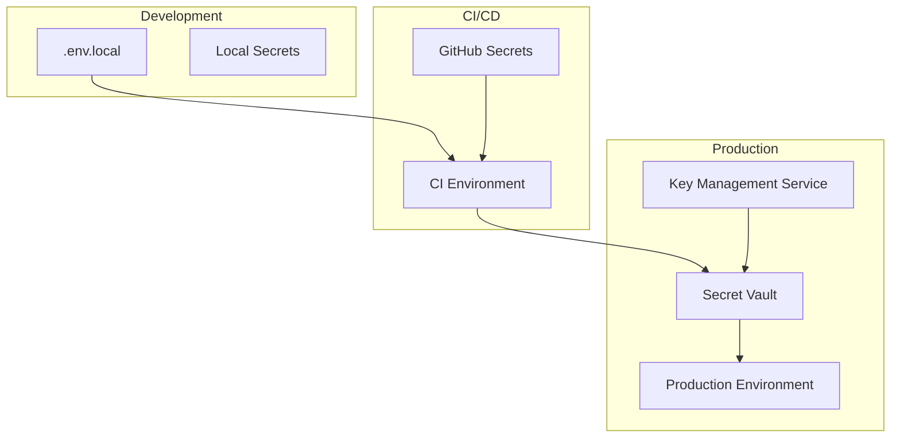
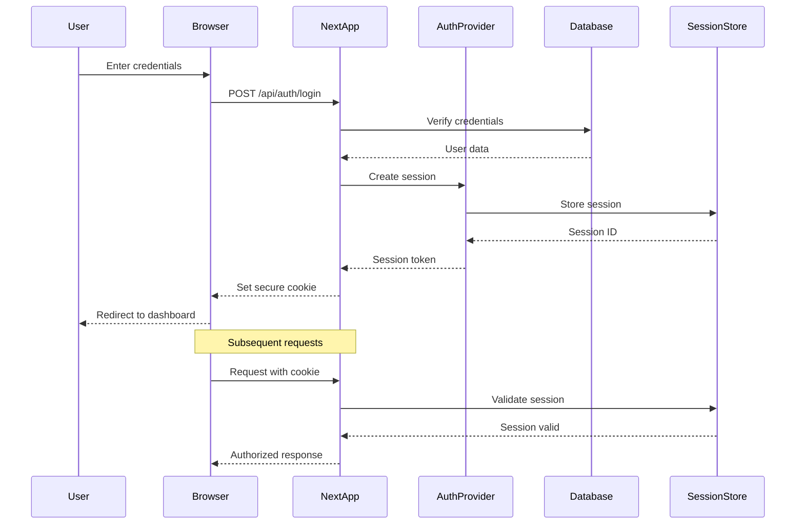

# Security Guidelines

## CSP Configuration

### Content Security Policy Overview

Content Security Policy (CSP) is a critical security header that helps prevent Cross-Site Scripting (XSS) attacks, clickjacking, and other code injection attacks. It works by specifying which sources of content are allowed to be loaded and executed on your website.

### CSP Implementation

#### Next.js Middleware Configuration

```typescript
// middleware.ts
import { NextRequest, NextResponse } from 'next/server';

export function middleware(request: NextRequest) {
  const response = NextResponse.next();
  
  // Content Security Policy
  const cspHeader = `
    default-src 'self';
    script-src 'self' 'unsafe-eval' 'unsafe-inline' https://www.googletagmanager.com https://www.google-analytics.com https://cdn.vercel-insights.com;
    style-src 'self' 'unsafe-inline' https://fonts.googleapis.com;
    img-src 'self' blob: data: https://*.googletagmanager.com https://www.google-analytics.com https://*.cloudinary.com;
    font-src 'self' https://fonts.gstatic.com data:;
    object-src 'none';
    base-uri 'self';
    form-action 'self' https://api.gohighlevel.com;
    frame-ancestors 'none';
    block-all-mixed-content;
    upgrade-insecure-requests;
    connect-src 'self' https://api.gohighlevel.com https://www.google-analytics.com https://analytics.google.com https://*.vercel-insights.com wss://localhost:* ws://localhost:*;
    media-src 'self' https://*.cloudinary.com;
    worker-src 'self' blob:;
    child-src 'self' blob:;
    manifest-src 'self';
    report-uri /api/csp-report;
  `.replace(/\s{2,}/g, ' ').trim();
  
  response.headers.set('Content-Security-Policy', cspHeader);
  
  // Additional Security Headers
  response.headers.set('X-Frame-Options', 'DENY');
  response.headers.set('X-Content-Type-Options', 'nosniff');
  response.headers.set('X-XSS-Protection', '1; mode=block');
  response.headers.set('Referrer-Policy', 'strict-origin-when-cross-origin');
  response.headers.set('Permissions-Policy', 'camera=(), microphone=(), geolocation=()');
  
  // Strict Transport Security (HSTS)
  if (process.env.NODE_ENV === 'production') {
    response.headers.set(
      'Strict-Transport-Security',
      'max-age=31536000; includeSubDomains; preload'
    );
  }
  
  return response;
}

export const config = {
  matcher: [
    /*
     * Match all request paths except for the ones starting with:
     * - api (API routes)
     * - _next/static (static files)
     * - _next/image (image optimization files)
     * - favicon.ico (favicon file)
     */
    '/((?!api|_next/static|_next/image|favicon.ico).*)',
  ],
};
```

#### CSP Report Endpoint

```typescript
// app/api/csp-report/route.ts
import { NextRequest, NextResponse } from 'next/server';
import { structuredLogger } from '@/lib/logger';

interface CSPReport {
  'csp-report': {
    'document-uri': string;
    'referrer': string;
    'violated-directive': string;
    'effective-directive': string;
    'original-policy': string;
    'disposition': string;
    'blocked-uri': string;
    'line-number'?: number;
    'column-number'?: number;
    'source-file'?: string;
    'status-code': number;
    'script-sample'?: string;
  };
}

export async function POST(request: NextRequest) {
  try {
    const report: CSPReport = await request.json();
    
    // Log CSP violation
    structuredLogger.warn('CSP Violation', {
      type: 'csp_violation',
      documentUri: report['csp-report']['document-uri'],
      blockedUri: report['csp-report']['blocked-uri'],
      violatedDirective: report['csp-report']['violated-directive'],
      sourceFile: report['csp-report']['source-file'],
      lineNumber: report['csp-report']['line-number'],
      columnNumber: report['csp-report']['column-number'],
      sample: report['csp-report']['script-sample'],
    });
    
    // In production, you might want to send this to a monitoring service
    if (process.env.NODE_ENV === 'production') {
      // Send to monitoring service
      await sendToMonitoring(report);
    }
    
    return NextResponse.json({ received: true }, { status: 204 });
  } catch (error) {
    console.error('Failed to process CSP report:', error);
    return NextResponse.json({ error: 'Invalid report' }, { status: 400 });
  }
}
```

### Environment-Specific CSP

```typescript
// lib/csp-config.ts
interface CSPConfig {
  [key: string]: string[];
}

const baseCSP: CSPConfig = {
  'default-src': ["'self'"],
  'script-src': ["'self'"],
  'style-src': ["'self'", "'unsafe-inline'"],
  'img-src': ["'self'", 'data:', 'blob:'],
  'font-src': ["'self'", 'data:'],
  'object-src': ["'none'"],
  'base-uri': ["'self'"],
  'form-action': ["'self'"],
  'frame-ancestors': ["'none'"],
  'block-all-mixed-content': [''],
  'upgrade-insecure-requests': [''],
};

const developmentCSP: CSPConfig = {
  ...baseCSP,
  'script-src': [
    ...baseCSP['script-src'],
    "'unsafe-eval'", // Required for Next.js hot reload
    "'unsafe-inline'", // Required for React DevTools
    'http://localhost:*',
    'ws://localhost:*',
  ],
  'connect-src': [
    "'self'",
    'http://localhost:*',
    'ws://localhost:*',
    'wss://localhost:*',
  ],
};

const productionCSP: CSPConfig = {
  ...baseCSP,
  'script-src': [
    ...baseCSP['script-src'],
    'https://www.googletagmanager.com',
    'https://www.google-analytics.com',
    'https://cdn.vercel-insights.com',
  ],
  'style-src': [
    ...baseCSP['style-src'],
    'https://fonts.googleapis.com',
  ],
  'img-src': [
    ...baseCSP['img-src'],
    'https://*.googletagmanager.com',
    'https://www.google-analytics.com',
    'https://*.cloudinary.com',
  ],
  'font-src': [
    ...baseCSP['font-src'],
    'https://fonts.gstatic.com',
  ],
  'connect-src': [
    "'self'",
    'https://api.gohighlevel.com',
    'https://www.google-analytics.com',
    'https://analytics.google.com',
    'https://*.vercel-insights.com',
  ],
  'report-uri': ['/api/csp-report'],
};

export function generateCSP(isDevelopment: boolean = false): string {
  const config = isDevelopment ? developmentCSP : productionCSP;
  
  return Object.entries(config)
    .map(([key, values]) => {
      if (values.length === 1 && values[0] === '') {
        return key;
      }
      return `${key} ${values.join(' ')}`;
    })
    .join('; ');
}
```

### CSP Nonce Implementation for Inline Scripts

```typescript
// lib/csp-nonce.ts
import crypto from 'crypto';

export function generateNonce(): string {
  return crypto.randomBytes(16).toString('base64');
}

// app/layout.tsx
import { generateNonce } from '@/lib/csp-nonce';
import { headers } from 'next/headers';

export default function RootLayout({
  children,
}: {
  children: React.ReactNode;
}) {
  const nonce = generateNonce();
  
  // Add nonce to CSP header
  const cspHeader = headers().get('Content-Security-Policy') || '';
  const updatedCSP = cspHeader.replace(
    /script-src ([^;]+)/,
    `script-src $1 'nonce-${nonce}'`
  );
  
  return (
    <html lang="en">
      <head>
        {/* Google Tag Manager with nonce */}
        <script
          nonce={nonce}
          dangerouslySetInnerHTML={{
            __html: `
              (function(w,d,s,l,i){w[l]=w[l]||[];w[l].push({'gtm.start':
              new Date().getTime(),event:'gtm.js'});var f=d.getElementsByTagName(s)[0],
              j=d.createElement(s),dl=l!='dataLayer'?'&l='+l:'';j.async=true;j.src=
              'https://www.googletagmanager.com/gtm.js?id='+i+dl;f.parentNode.insertBefore(j,f);
              })(window,document,'script','dataLayer','${process.env.NEXT_PUBLIC_GTM_ID}');
            `,
          }}
        />
      </head>
      <body>{children}</body>
    </html>
  );
}
```

## Environment Secrets

### Secret Management Architecture



### Environment Variable Security

#### Secret Classification

```typescript
// config/secrets.ts
export enum SecretClassification {
  PUBLIC = 'PUBLIC',        // Can be exposed to client
  PRIVATE = 'PRIVATE',      // Server-side only
  SENSITIVE = 'SENSITIVE',  // Requires encryption
  CRITICAL = 'CRITICAL',    // Requires HSM/KMS
}

interface SecretDefinition {
  name: string;
  classification: SecretClassification;
  description: string;
  validator?: (value: string) => boolean;
  required: boolean;
}

export const secretDefinitions: SecretDefinition[] = [
  // Public secrets (NEXT_PUBLIC_*)
  {
    name: 'NEXT_PUBLIC_APP_URL',
    classification: SecretClassification.PUBLIC,
    description: 'Public application URL',
    required: true,
    validator: (value) => value.startsWith('http'),
  },
  {
    name: 'NEXT_PUBLIC_GA_MEASUREMENT_ID',
    classification: SecretClassification.PUBLIC,
    description: 'Google Analytics measurement ID',
    required: false,
    validator: (value) => /^G-[A-Z0-9]+$/.test(value),
  },
  
  // Private secrets
  {
    name: 'DATABASE_URL',
    classification: SecretClassification.SENSITIVE,
    description: 'Database connection string',
    required: true,
    validator: (value) => value.includes('postgresql://'),
  },
  {
    name: 'SESSION_SECRET',
    classification: SecretClassification.SENSITIVE,
    description: 'Session encryption secret',
    required: true,
    validator: (value) => value.length >= 32,
  },
  
  // Critical secrets
  {
    name: 'STRIPE_SECRET_KEY',
    classification: SecretClassification.CRITICAL,
    description: 'Stripe API secret key',
    required: true,
    validator: (value) => value.startsWith('sk_'),
  },
  {
    name: 'GHL_API_KEY',
    classification: SecretClassification.CRITICAL,
    description: 'GoHighLevel API key',
    required: true,
    validator: (value) => value.length > 0,
  },
];
```

#### Secret Validation

```typescript
// lib/validate-secrets.ts
import { secretDefinitions, SecretClassification } from '@/config/secrets';

export interface SecretValidationResult {
  valid: boolean;
  errors: string[];
  warnings: string[];
}

export function validateSecrets(): SecretValidationResult {
  const errors: string[] = [];
  const warnings: string[] = [];
  
  for (const secret of secretDefinitions) {
    const value = process.env[secret.name];
    
    // Check if required secret exists
    if (secret.required && !value) {
      errors.push(`Missing required secret: ${secret.name}`);
      continue;
    }
    
    // Skip validation if optional and not provided
    if (!secret.required && !value) {
      continue;
    }
    
    // Validate secret format
    if (secret.validator && value && !secret.validator(value)) {
      errors.push(`Invalid format for secret: ${secret.name}`);
    }
    
    // Check for exposed sensitive secrets
    if (
      secret.classification !== SecretClassification.PUBLIC &&
      secret.name.startsWith('NEXT_PUBLIC_')
    ) {
      errors.push(
        `Sensitive secret ${secret.name} should not use NEXT_PUBLIC_ prefix`
      );
    }
    
    // Warn about unencrypted sensitive secrets in development
    if (
      process.env.NODE_ENV === 'development' &&
      secret.classification === SecretClassification.SENSITIVE
    ) {
      warnings.push(
        `Sensitive secret ${secret.name} is unencrypted in development`
      );
    }
  }
  
  return {
    valid: errors.length === 0,
    errors,
    warnings,
  };
}

// Validate on startup
if (process.env.NODE_ENV === 'production') {
  const validation = validateSecrets();
  if (!validation.valid) {
    console.error('Secret validation failed:', validation.errors);
    process.exit(1);
  }
}
```

### Secret Storage Solutions

#### 1. Vault Integration

```typescript
// lib/vault-client.ts
import { VaultClient } from '@hashicorp/vault';

class SecretManager {
  private client: VaultClient;
  private cache: Map<string, { value: string; expires: number }> = new Map();
  
  constructor() {
    this.client = new VaultClient({
      endpoint: process.env.VAULT_ENDPOINT!,
      token: process.env.VAULT_TOKEN!,
    });
  }
  
  async getSecret(path: string): Promise<string> {
    // Check cache first
    const cached = this.cache.get(path);
    if (cached && cached.expires > Date.now()) {
      return cached.value;
    }
    
    try {
      // Fetch from Vault
      const response = await this.client.read(`secret/data/${path}`);
      const value = response.data.data.value;
      
      // Cache for 5 minutes
      this.cache.set(path, {
        value,
        expires: Date.now() + 5 * 60 * 1000,
      });
      
      return value;
    } catch (error) {
      console.error(`Failed to fetch secret ${path}:`, error);
      throw new Error('Secret fetch failed');
    }
  }
  
  async rotateSecret(path: string, newValue: string): Promise<void> {
    try {
      await this.client.write(`secret/data/${path}`, {
        data: { value: newValue },
      });
      
      // Clear cache
      this.cache.delete(path);
      
      // Log rotation
      console.log(`Secret rotated: ${path}`);
    } catch (error) {
      console.error(`Failed to rotate secret ${path}:`, error);
      throw new Error('Secret rotation failed');
    }
  }
}

export const secretManager = new SecretManager();
```

#### 2. AWS Secrets Manager

```typescript
// lib/aws-secrets.ts
import {
  SecretsManagerClient,
  GetSecretValueCommand,
  UpdateSecretCommand,
} from '@aws-sdk/client-secrets-manager';

const client = new SecretsManagerClient({
  region: process.env.AWS_REGION!,
});

export async function getSecretFromAWS(secretName: string): Promise<string> {
  try {
    const command = new GetSecretValueCommand({
      SecretId: secretName,
    });
    
    const response = await client.send(command);
    
    if ('SecretString' in response) {
      return response.SecretString!;
    } else if ('SecretBinary' in response) {
      const buff = Buffer.from(response.SecretBinary!);
      return buff.toString('utf-8');
    }
    
    throw new Error('Secret value not found');
  } catch (error) {
    console.error(`Failed to retrieve secret ${secretName}:`, error);
    throw error;
  }
}

export async function updateSecretInAWS(
  secretName: string,
  secretValue: string
): Promise<void> {
  try {
    const command = new UpdateSecretCommand({
      SecretId: secretName,
      SecretString: secretValue,
    });
    
    await client.send(command);
    console.log(`Secret ${secretName} updated successfully`);
  } catch (error) {
    console.error(`Failed to update secret ${secretName}:`, error);
    throw error;
  }
}
```

### Secret Rotation

```typescript
// lib/secret-rotation.ts
import crypto from 'crypto';
import { secretManager } from './vault-client';

interface RotationConfig {
  secretPath: string;
  rotationInterval: number; // in days
  generator: () => string;
  validator: (value: string) => boolean;
  onRotation?: (oldValue: string, newValue: string) => Promise<void>;
}

class SecretRotationManager {
  private rotationConfigs: RotationConfig[] = [];
  
  register(config: RotationConfig) {
    this.rotationConfigs.push(config);
  }
  
  async checkAndRotate() {
    for (const config of this.rotationConfigs) {
      try {
        const shouldRotate = await this.shouldRotateSecret(config);
        
        if (shouldRotate) {
          await this.rotateSecret(config);
        }
      } catch (error) {
        console.error(`Rotation check failed for ${config.secretPath}:`, error);
      }
    }
  }
  
  private async shouldRotateSecret(config: RotationConfig): Promise<boolean> {
    // Check last rotation time from metadata
    const metadata = await secretManager.getSecretMetadata(config.secretPath);
    const lastRotation = new Date(metadata.lastRotation);
    const daysSinceRotation = 
      (Date.now() - lastRotation.getTime()) / (1000 * 60 * 60 * 24);
    
    return daysSinceRotation >= config.rotationInterval;
  }
  
  private async rotateSecret(config: RotationConfig) {
    const oldValue = await secretManager.getSecret(config.secretPath);
    let newValue: string;
    
    // Generate new secret
    do {
      newValue = config.generator();
    } while (!config.validator(newValue));
    
    // Perform rotation
    await secretManager.rotateSecret(config.secretPath, newValue);
    
    // Run post-rotation hook if provided
    if (config.onRotation) {
      await config.onRotation(oldValue, newValue);
    }
    
    console.log(`Secret rotated successfully: ${config.secretPath}`);
  }
}

// Example rotation configurations
const rotationManager = new SecretRotationManager();

// API key rotation
rotationManager.register({
  secretPath: 'api/internal-api-key',
  rotationInterval: 90, // 90 days
  generator: () => crypto.randomBytes(32).toString('hex'),
  validator: (value) => value.length === 64,
  onRotation: async (oldValue, newValue) => {
    // Update API key in connected services
    await updateConnectedServices(oldValue, newValue);
  },
});

// Database password rotation
rotationManager.register({
  secretPath: 'database/app-user-password',
  rotationInterval: 30, // 30 days
  generator: () => {
    const chars = 'ABCDEFGHIJKLMNOPQRSTUVWXYZabcdefghijklmnopqrstuvwxyz0123456789!@#$%^&*';
    let password = '';
    for (let i = 0; i < 32; i++) {
      password += chars.charAt(Math.floor(Math.random() * chars.length));
    }
    return password;
  },
  validator: (value) => {
    // Must contain uppercase, lowercase, number, and special character
    return /^(?=.*[a-z])(?=.*[A-Z])(?=.*\d)(?=.*[@$!%*?&])[A-Za-z\d@$!%*?&]{32,}$/.test(value);
  },
  onRotation: async (oldValue, newValue) => {
    // Update database user password
    await updateDatabasePassword('app_user', newValue);
  },
});
```

## Authentication Flow

### Authentication Architecture



### JWT-Based Authentication Implementation

```typescript
// lib/auth/jwt.ts
import jwt from 'jsonwebtoken';
import { User } from '@/types/user';

interface TokenPayload {
  userId: string;
  email: string;
  role: string;
  sessionId: string;
}

interface TokenPair {
  accessToken: string;
  refreshToken: string;
}

export class JWTManager {
  private readonly accessTokenSecret = process.env.JWT_ACCESS_SECRET!;
  private readonly refreshTokenSecret = process.env.JWT_REFRESH_SECRET!;
  private readonly accessTokenExpiry = '15m';
  private readonly refreshTokenExpiry = '7d';
  
  generateTokenPair(user: User, sessionId: string): TokenPair {
    const payload: TokenPayload = {
      userId: user.id,
      email: user.email,
      role: user.role,
      sessionId,
    };
    
    const accessToken = jwt.sign(payload, this.accessTokenSecret, {
      expiresIn: this.accessTokenExpiry,
      issuer: 'americanfaithacademy.org',
      audience: 'afa-web',
    });
    
    const refreshToken = jwt.sign(
      { userId: user.id, sessionId },
      this.refreshTokenSecret,
      {
        expiresIn: this.refreshTokenExpiry,
        issuer: 'americanfaithacademy.org',
        audience: 'afa-web-refresh',
      }
    );
    
    return { accessToken, refreshToken };
  }
  
  verifyAccessToken(token: string): TokenPayload {
    try {
      return jwt.verify(token, this.accessTokenSecret, {
        issuer: 'americanfaithacademy.org',
        audience: 'afa-web',
      }) as TokenPayload;
    } catch (error) {
      if (error instanceof jwt.TokenExpiredError) {
        throw new Error('Access token expired');
      }
      throw new Error('Invalid access token');
    }
  }
  
  verifyRefreshToken(token: string): { userId: string; sessionId: string } {
    try {
      return jwt.verify(token, this.refreshTokenSecret, {
        issuer: 'americanfaithacademy.org',
        audience: 'afa-web-refresh',
      }) as { userId: string; sessionId: string };
    } catch (error) {
      if (error instanceof jwt.TokenExpiredError) {
        throw new Error('Refresh token expired');
      }
      throw new Error('Invalid refresh token');
    }
  }
  
  async refreshTokens(refreshToken: string): Promise<TokenPair> {
    const payload = this.verifyRefreshToken(refreshToken);
    
    // Verify session is still valid
    const session = await getSession(payload.sessionId);
    if (!session || session.revoked) {
      throw new Error('Session invalid');
    }
    
    // Get user data
    const user = await getUser(payload.userId);
    if (!user || !user.active) {
      throw new Error('User inactive');
    }
    
    // Generate new token pair
    return this.generateTokenPair(user, payload.sessionId);
  }
}

export const jwtManager = new JWTManager();
```

### Session Management

```typescript
// lib/auth/session.ts
import { Redis } from 'ioredis';
import crypto from 'crypto';

interface Session {
  id: string;
  userId: string;
  createdAt: Date;
  expiresAt: Date;
  ipAddress: string;
  userAgent: string;
  revoked: boolean;
  lastActivity: Date;
}

export class SessionManager {
  private redis: Redis;
  private sessionTTL = 7 * 24 * 60 * 60; // 7 days in seconds
  
  constructor() {
    this.redis = new Redis({
      host: process.env.REDIS_HOST,
      port: parseInt(process.env.REDIS_PORT || '6379'),
      password: process.env.REDIS_PASSWORD,
      tls: process.env.NODE_ENV === 'production' ? {} : undefined,
    });
  }
  
  async createSession(
    userId: string,
    ipAddress: string,
    userAgent: string
  ): Promise<Session> {
    const sessionId = crypto.randomBytes(32).toString('hex');
    const now = new Date();
    const expiresAt = new Date(now.getTime() + this.sessionTTL * 1000);
    
    const session: Session = {
      id: sessionId,
      userId,
      createdAt: now,
      expiresAt,
      ipAddress,
      userAgent,
      revoked: false,
      lastActivity: now,
    };
    
    // Store in Redis
    await this.redis.setex(
      `session:${sessionId}`,
      this.sessionTTL,
      JSON.stringify(session)
    );
    
    // Add to user's session list
    await this.redis.sadd(`user:${userId}:sessions`, sessionId);
    
    return session;
  }
  
  async getSession(sessionId: string): Promise<Session | null> {
    const data = await this.redis.get(`session:${sessionId}`);
    if (!data) return null;
    
    const session = JSON.parse(data) as Session;
    
    // Check if expired
    if (new Date(session.expiresAt) < new Date()) {
      await this.revokeSession(sessionId);
      return null;
    }
    
    return session;
  }
  
  async updateActivity(sessionId: string): Promise<void> {
    const session = await this.getSession(sessionId);
    if (!session) return;
    
    session.lastActivity = new Date();
    
    await this.redis.setex(
      `session:${sessionId}`,
      this.sessionTTL,
      JSON.stringify(session)
    );
  }
  
  async revokeSession(sessionId: string): Promise<void> {
    const session = await this.getSession(sessionId);
    if (!session) return;
    
    session.revoked = true;
    
    // Update session
    await this.redis.setex(
      `session:${sessionId}`,
      300, // Keep for 5 minutes for logging
      JSON.stringify(session)
    );
    
    // Remove from user's active sessions
    await this.redis.srem(`user:${session.userId}:sessions`, sessionId);
  }
  
  async revokeAllUserSessions(userId: string): Promise<void> {
    const sessionIds = await this.redis.smembers(`user:${userId}:sessions`);
    
    for (const sessionId of sessionIds) {
      await this.revokeSession(sessionId);
    }
  }
  
  async getUserActiveSessions(userId: string): Promise<Session[]> {
    const sessionIds = await this.redis.smembers(`user:${userId}:sessions`);
    const sessions: Session[] = [];
    
    for (const sessionId of sessionIds) {
      const session = await this.getSession(sessionId);
      if (session && !session.revoked) {
        sessions.push(session);
      }
    }
    
    return sessions;
  }
}

export const sessionManager = new SessionManager();
```

### Authentication Middleware

```typescript
// middleware/auth.ts
import { NextRequest, NextResponse } from 'next/server';
import { jwtManager } from '@/lib/auth/jwt';
import { sessionManager } from '@/lib/auth/session';

export interface AuthenticatedRequest extends NextRequest {
  user?: {
    id: string;
    email: string;
    role: string;
  };
  session?: {
    id: string;
  };
}

export async function authMiddleware(
  request: AuthenticatedRequest
): Promise<NextResponse | null> {
  // Skip authentication for public routes
  const publicRoutes = ['/api/auth/login', '/api/auth/register', '/api/health'];
  if (publicRoutes.some(route => request.nextUrl.pathname.startsWith(route))) {
    return null;
  }
  
  try {
    // Get token from cookie or header
    const token = request.cookies.get('access_token')?.value ||
                  request.headers.get('authorization')?.replace('Bearer ', '');
    
    if (!token) {
      return NextResponse.json(
        { error: 'Authentication required' },
        { status: 401 }
      );
    }
    
    // Verify token
    const payload = jwtManager.verifyAccessToken(token);
    
    // Verify session
    const session = await sessionManager.getSession(payload.sessionId);
    if (!session || session.revoked) {
      return NextResponse.json(
        { error: 'Session invalid' },
        { status: 401 }
      );
    }
    
    // Update session activity
    await sessionManager.updateActivity(payload.sessionId);
    
    // Attach user info to request
    request.user = {
      id: payload.userId,
      email: payload.email,
      role: payload.role,
    };
    request.session = {
      id: payload.sessionId,
    };
    
    return null; // Continue to route handler
  } catch (error) {
    if (error.message === 'Access token expired') {
      return NextResponse.json(
        { error: 'Token expired', code: 'TOKEN_EXPIRED' },
        { status: 401 }
      );
    }
    
    return NextResponse.json(
      { error: 'Invalid authentication' },
      { status: 401 }
    );
  }
}
```

### Multi-Factor Authentication (MFA)

```typescript
// lib/auth/mfa.ts
import speakeasy from 'speakeasy';
import QRCode from 'qrcode';

interface MFASecret {
  userId: string;
  secret: string;
  backupCodes: string[];
  createdAt: Date;
  verified: boolean;
}

export class MFAManager {
  async setupMFA(userId: string, userEmail: string): Promise<{
    secret: string;
    qrCode: string;
    backupCodes: string[];
  }> {
    // Generate secret
    const secret = speakeasy.generateSecret({
      name: `AFA (${userEmail})`,
      issuer: 'American Faith Academy',
      length: 32,
    });
    
    // Generate backup codes
    const backupCodes = this.generateBackupCodes(8);
    
    // Store secret (encrypted in production)
    const mfaSecret: MFASecret = {
      userId,
      secret: secret.base32,
      backupCodes,
      createdAt: new Date(),
      verified: false,
    };
    
    await this.storeMFASecret(mfaSecret);
    
    // Generate QR code
    const qrCode = await QRCode.toDataURL(secret.otpauth_url!);
    
    return {
      secret: secret.base32,
      qrCode,
      backupCodes,
    };
  }
  
  async verifyMFAToken(userId: string, token: string): Promise<boolean> {
    const mfaSecret = await this.getMFASecret(userId);
    if (!mfaSecret) return false;
    
    // Check if it's a backup code
    if (mfaSecret.backupCodes.includes(token)) {
      // Remove used backup code
      mfaSecret.backupCodes = mfaSecret.backupCodes.filter(code => code !== token);
      await this.updateMFASecret(mfaSecret);
      return true;
    }
    
    // Verify TOTP token
    const verified = speakeasy.totp.verify({
      secret: mfaSecret.secret,
      encoding: 'base32',
      token,
      window: 2, // Allow 2 time steps tolerance
    });
    
    // Mark as verified on first successful verification
    if (verified && !mfaSecret.verified) {
      mfaSecret.verified = true;
      await this.updateMFASecret(mfaSecret);
    }
    
    return verified;
  }
  
  private generateBackupCodes(count: number): string[] {
    const codes: string[] = [];
    for (let i = 0; i < count; i++) {
      const code = crypto.randomBytes(4).toString('hex').toUpperCase();
      codes.push(`${code.slice(0, 4)}-${code.slice(4)}`);
    }
    return codes;
  }
  
  private async storeMFASecret(secret: MFASecret): Promise<void> {
    // In production, encrypt the secret before storing
    await db.mfaSecrets.create({
      data: {
        userId: secret.userId,
        secret: await encrypt(secret.secret),
        backupCodes: await encrypt(JSON.stringify(secret.backupCodes)),
        verified: secret.verified,
      },
    });
  }
  
  private async getMFASecret(userId: string): Promise<MFASecret | null> {
    const data = await db.mfaSecrets.findUnique({
      where: { userId },
    });
    
    if (!data) return null;
    
    return {
      userId: data.userId,
      secret: await decrypt(data.secret),
      backupCodes: JSON.parse(await decrypt(data.backupCodes)),
      createdAt: data.createdAt,
      verified: data.verified,
    };
  }
}
```

## OWASP Compliance

### OWASP Top 10 Security Controls

#### 1. Injection Prevention

```typescript
// lib/security/injection-prevention.ts
import { sql } from '@vercel/postgres';
import DOMPurify from 'isomorphic-dompurify';

// SQL Injection Prevention
export class SafeDatabase {
  // Always use parameterized queries
  async getUserByEmail(email: string) {
    // ✅ Safe - Using parameterized query
    const result = await sql`
      SELECT * FROM users 
      WHERE email = ${email}
    `;
    return result.rows[0];
  }
  
  // ❌ Never do this
  async unsafeGetUser(email: string) {
    // This is vulnerable to SQL injection
    // const query = `SELECT * FROM users WHERE email = '${email}'`;
    // Never concatenate user input into queries!
  }
  
  // Safe dynamic queries
  async searchUsers(filters: Record<string, any>) {
    const conditions: string[] = [];
    const values: any[] = [];
    let paramCount = 1;
    
    for (const [key, value] of Object.entries(filters)) {
      // Whitelist allowed columns
      const allowedColumns = ['name', 'email', 'role', 'status'];
      if (!allowedColumns.includes(key)) continue;
      
      conditions.push(`${key} = $${paramCount}`);
      values.push(value);
      paramCount++;
    }
    
    if (conditions.length === 0) {
      return [];
    }
    
    const query = `
      SELECT * FROM users 
      WHERE ${conditions.join(' AND ')}
    `;
    
    return await sql.query(query, values);
  }
}

// XSS Prevention
export function sanitizeHTML(input: string): string {
  return DOMPurify.sanitize(input, {
    ALLOWED_TAGS: ['b', 'i', 'em', 'strong', 'a', 'p', 'br'],
    ALLOWED_ATTR: ['href', 'target', 'rel'],
  });
}

// Command Injection Prevention
export function executeCommand(userInput: string) {
  // Whitelist allowed commands
  const allowedCommands = ['status', 'health', 'version'];
  
  if (!allowedCommands.includes(userInput)) {
    throw new Error('Invalid command');
  }
  
  // Use spawn instead of exec for better control
  const { spawn } = require('child_process');
  const child = spawn('app-cli', [userInput], {
    shell: false, // Disable shell interpretation
  });
  
  return child;
}
```

#### 2. Broken Authentication Prevention

```typescript
// lib/security/auth-security.ts
import bcrypt from 'bcrypt';
import { z } from 'zod';

// Password policy enforcement
const passwordSchema = z.string()
  .min(12, 'Password must be at least 12 characters')
  .regex(/[A-Z]/, 'Password must contain at least one uppercase letter')
  .regex(/[a-z]/, 'Password must contain at least one lowercase letter')
  .regex(/[0-9]/, 'Password must contain at least one number')
  .regex(/[^A-Za-z0-9]/, 'Password must contain at least one special character');

export async function hashPassword(password: string): Promise<string> {
  // Validate password strength
  passwordSchema.parse(password);
  
  // Use bcrypt with appropriate cost factor
  const saltRounds = 12;
  return await bcrypt.hash(password, saltRounds);
}

// Account lockout mechanism
interface LoginAttempt {
  email: string;
  attempts: number;
  lastAttempt: Date;
  lockedUntil?: Date;
}

export class AccountLockout {
  private maxAttempts = 5;
  private lockoutDuration = 30 * 60 * 1000; // 30 minutes
  private attempts = new Map<string, LoginAttempt>();
  
  async recordFailedAttempt(email: string): Promise<boolean> {
    const attempt = this.attempts.get(email) || {
      email,
      attempts: 0,
      lastAttempt: new Date(),
    };
    
    // Reset if last attempt was more than 1 hour ago
    if (Date.now() - attempt.lastAttempt.getTime() > 60 * 60 * 1000) {
      attempt.attempts = 0;
    }
    
    attempt.attempts++;
    attempt.lastAttempt = new Date();
    
    if (attempt.attempts >= this.maxAttempts) {
      attempt.lockedUntil = new Date(Date.now() + this.lockoutDuration);
    }
    
    this.attempts.set(email, attempt);
    
    return attempt.attempts >= this.maxAttempts;
  }
  
  async isLocked(email: string): Promise<boolean> {
    const attempt = this.attempts.get(email);
    if (!attempt || !attempt.lockedUntil) return false;
    
    if (attempt.lockedUntil > new Date()) {
      return true;
    }
    
    // Unlock if lockout period has passed
    this.attempts.delete(email);
    return false;
  }
  
  async clearAttempts(email: string): Promise<void> {
    this.attempts.delete(email);
  }
}
```

#### 3. Sensitive Data Exposure Prevention

```typescript
// lib/security/data-protection.ts
import crypto from 'crypto';

// Encryption for sensitive data at rest
export class DataEncryption {
  private algorithm = 'aes-256-gcm';
  private keyDerivationIterations = 100000;
  
  private deriveKey(password: string, salt: Buffer): Buffer {
    return crypto.pbkdf2Sync(
      password,
      salt,
      this.keyDerivationIterations,
      32,
      'sha256'
    );
  }
  
  encrypt(text: string, password: string): {
    encrypted: string;
    salt: string;
    iv: string;
    authTag: string;
  } {
    const salt = crypto.randomBytes(32);
    const key = this.deriveKey(password, salt);
    const iv = crypto.randomBytes(16);
    
    const cipher = crypto.createCipheriv(this.algorithm, key, iv);
    
    let encrypted = cipher.update(text, 'utf8', 'hex');
    encrypted += cipher.final('hex');
    
    const authTag = cipher.getAuthTag();
    
    return {
      encrypted,
      salt: salt.toString('hex'),
      iv: iv.toString('hex'),
      authTag: authTag.toString('hex'),
    };
  }
  
  decrypt(encryptedData: {
    encrypted: string;
    salt: string;
    iv: string;
    authTag: string;
  }, password: string): string {
    const salt = Buffer.from(encryptedData.salt, 'hex');
    const key = this.deriveKey(password, salt);
    const iv = Buffer.from(encryptedData.iv, 'hex');
    const authTag = Buffer.from(encryptedData.authTag, 'hex');
    
    const decipher = crypto.createDecipheriv(this.algorithm, key, iv);
    decipher.setAuthTag(authTag);
    
    let decrypted = decipher.update(encryptedData.encrypted, 'hex', 'utf8');
    decrypted += decipher.final('utf8');
    
    return decrypted;
  }
}

// PII data masking
export function maskPII(data: any): any {
  const piiFields = ['ssn', 'creditCard', 'bankAccount', 'dateOfBirth'];
  
  function mask(obj: any): any {
    if (typeof obj !== 'object' || obj === null) return obj;
    
    const masked = Array.isArray(obj) ? [] : {};
    
    for (const [key, value] of Object.entries(obj)) {
      if (piiFields.includes(key) && typeof value === 'string') {
        // Mask all but last 4 characters
        masked[key] = value.length > 4
          ? '*'.repeat(value.length - 4) + value.slice(-4)
          : '*'.repeat(value.length);
      } else if (typeof value === 'object') {
        masked[key] = mask(value);
      } else {
        masked[key] = value;
      }
    }
    
    return masked;
  }
  
  return mask(data);
}
```

#### 4. XML External Entities (XXE) Prevention

```typescript
// lib/security/xxe-prevention.ts
import { parseStringPromise } from 'xml2js';

// Safe XML parsing
export async function safeParseXML(xmlString: string): Promise<any> {
  const parserOptions = {
    // Disable DTD processing
    explicitArray: false,
    ignoreAttrs: false,
    parseTrueNumberOnly: true,
    // Security options
    strict: true,
    normalize: true,
    normalizeTags: true,
    // Prevent XXE
    xmlns: false,
    allowDtd: false,
    xmlnsPrefix: false,
  };
  
  try {
    const result = await parseStringPromise(xmlString, parserOptions);
    return result;
  } catch (error) {
    throw new Error('Invalid XML format');
  }
}

// Validate XML against schema
export function validateXMLStructure(xmlObj: any, expectedStructure: any): boolean {
  // Implement schema validation
  // This is a simplified example
  for (const key of Object.keys(expectedStructure)) {
    if (!(key in xmlObj)) {
      return false;
    }
  }
  return true;
}
```

#### 5. Security Misconfiguration Prevention

```typescript
// lib/security/security-headers.ts
import { NextResponse } from 'next/server';

export function applySecurityHeaders(response: NextResponse): NextResponse {
  // Remove server identification
  response.headers.delete('X-Powered-By');
  response.headers.delete('Server');
  
  // Security headers
  const securityHeaders = {
    // Prevent clickjacking
    'X-Frame-Options': 'DENY',
    
    // Prevent MIME type sniffing
    'X-Content-Type-Options': 'nosniff',
    
    // Enable XSS filter
    'X-XSS-Protection': '1; mode=block',
    
    // Referrer policy
    'Referrer-Policy': 'strict-origin-when-cross-origin',
    
    // Feature policy / Permissions policy
    'Permissions-Policy': 'camera=(), microphone=(), geolocation=(), payment=()',
    
    // HSTS
    'Strict-Transport-Security': 'max-age=31536000; includeSubDomains; preload',
    
    // DNS prefetch control
    'X-DNS-Prefetch-Control': 'on',
    
    // Download options
    'X-Download-Options': 'noopen',
    
    // Permitted cross-domain policies
    'X-Permitted-Cross-Domain-Policies': 'none',
  };
  
  for (const [key, value] of Object.entries(securityHeaders)) {
    response.headers.set(key, value);
  }
  
  return response;
}

// Error handling without information disclosure
export function sanitizeError(error: Error): { message: string; code: string } {
  // Don't expose internal error details in production
  if (process.env.NODE_ENV === 'production') {
    // Log the actual error internally
    console.error('Internal error:', error);
    
    // Return generic error to client
    return {
      message: 'An error occurred processing your request',
      code: 'INTERNAL_ERROR',
    };
  }
  
  // In development, return more details
  return {
    message: error.message,
    code: error.name,
  };
}
```

### Security Testing Implementation

```typescript
// lib/security/security-scanner.ts
import { execSync } from 'child_process';
import fs from 'fs';

export class SecurityScanner {
  // Dependency vulnerability scanning
  async scanDependencies(): Promise<{
    vulnerabilities: any[];
    summary: {
      critical: number;
      high: number;
      moderate: number;
      low: number;
    };
  }> {
    try {
      // Run npm audit
      const auditResult = execSync('npm audit --json', {
        encoding: 'utf8',
      });
      
      const audit = JSON.parse(auditResult);
      
      return {
        vulnerabilities: audit.vulnerabilities || [],
        summary: {
          critical: audit.metadata.vulnerabilities.critical || 0,
          high: audit.metadata.vulnerabilities.high || 0,
          moderate: audit.metadata.vulnerabilities.moderate || 0,
          low: audit.metadata.vulnerabilities.low || 0,
        },
      };
    } catch (error) {
      console.error('Dependency scan failed:', error);
      throw error;
    }
  }
  
  // Static code analysis for security issues
  async scanCode(): Promise<any> {
    // This would integrate with tools like ESLint security plugins
    // Example with eslint-plugin-security
    try {
      const result = execSync('npx eslint . --ext .ts,.tsx --format json', {
        encoding: 'utf8',
      });
      
      return JSON.parse(result);
    } catch (error) {
      // ESLint returns non-zero exit code when issues found
      if (error.stdout) {
        return JSON.parse(error.stdout);
      }
      throw error;
    }
  }
  
  // Check for hardcoded secrets
  async scanSecrets(): Promise<string[]> {
    const secretPatterns = [
      /api[_-]?key\s*[:=]\s*["'][^"']+["']/gi,
      /secret\s*[:=]\s*["'][^"']+["']/gi,
      /password\s*[:=]\s*["'][^"']+["']/gi,
      /token\s*[:=]\s*["'][^"']+["']/gi,
      /private[_-]?key\s*[:=]\s*["'][^"']+["']/gi,
    ];
    
    const findings: string[] = [];
    const files = this.getSourceFiles();
    
    for (const file of files) {
      const content = fs.readFileSync(file, 'utf8');
      const lines = content.split('\n');
      
      lines.forEach((line, index) => {
        for (const pattern of secretPatterns) {
          if (pattern.test(line)) {
            findings.push(`${file}:${index + 1} - Potential hardcoded secret`);
          }
        }
      });
    }
    
    return findings;
  }
  
  private getSourceFiles(): string[] {
    // Get all TypeScript/JavaScript files
    const files: string[] = [];
    
    function walkDir(dir: string) {
      const entries = fs.readdirSync(dir, { withFileTypes: true });
      
      for (const entry of entries) {
        const path = `${dir}/${entry.name}`;
        
        if (entry.isDirectory()) {
          if (!['node_modules', '.git', '.next'].includes(entry.name)) {
            walkDir(path);
          }
        } else if (entry.isFile()) {
          if (/\.(ts|tsx|js|jsx)$/.test(entry.name)) {
            files.push(path);
          }
        }
      }
    }
    
    walkDir('./src');
    return files;
  }
}
```

## Vulnerability Reporting

### Security Policy

```markdown
# Security Policy

## Supported Versions

| Version | Supported          |
| ------- | ------------------ |
| 1.x.x   | :white_check_mark: |
| < 1.0   | :x:                |

## Reporting a Vulnerability

American Faith Academy takes security seriously. We appreciate your efforts to responsibly disclose your findings.

### Where to Report

**Email**: security@americanfaithacademy.org  
**PGP Key**: [Download our PGP key](https://americanfaithacademy.org/.well-known/pgp-key.txt)

### What to Include

Please provide:
1. Description of the vulnerability
2. Steps to reproduce
3. Potential impact
4. Suggested fix (if any)
5. Your contact information

### Response Timeline

- **Initial Response**: Within 48 hours
- **Status Update**: Within 5 business days
- **Resolution Target**: Based on severity
  - Critical: 7 days
  - High: 14 days
  - Medium: 30 days
  - Low: 90 days

### Bug Bounty Program

We offer rewards for valid security vulnerabilities:
- Critical: $1,000 - $5,000
- High: $500 - $1,000
- Medium: $100 - $500
- Low: $50 - $100

### Out of Scope

- Denial of Service attacks
- Social engineering
- Physical attacks
- Vulnerabilities in third-party services
```

### Vulnerability Response Process

```typescript
// lib/security/vulnerability-response.ts
interface VulnerabilityReport {
  id: string;
  reportedAt: Date;
  reportedBy: string;
  severity: 'critical' | 'high' | 'medium' | 'low';
  title: string;
  description: string;
  stepsToReproduce: string[];
  impact: string;
  status: 'new' | 'triaged' | 'confirmed' | 'in-progress' | 'resolved' | 'declined';
  assignedTo?: string;
  resolution?: string;
  resolvedAt?: Date;
}

export class VulnerabilityManager {
  async processReport(report: Omit<VulnerabilityReport, 'id' | 'status'>): Promise<string> {
    const id = this.generateReportId();
    
    const fullReport: VulnerabilityReport = {
      ...report,
      id,
      status: 'new',
    };
    
    // Store report
    await this.storeReport(fullReport);
    
    // Send acknowledgment
    await this.sendAcknowledgment(fullReport);
    
    // Notify security team
    await this.notifySecurityTeam(fullReport);
    
    // Start triage process
    await this.startTriage(fullReport);
    
    return id;
  }
  
  private generateReportId(): string {
    const date = new Date().toISOString().split('T')[0].replace(/-/g, '');
    const random = Math.random().toString(36).substring(2, 6).toUpperCase();
    return `VULN-${date}-${random}`;
  }
  
  private async sendAcknowledgment(report: VulnerabilityReport): Promise<void> {
    const email = {
      to: report.reportedBy,
      subject: `Vulnerability Report Received - ${report.id}`,
      body: `
Dear Security Researcher,

Thank you for your vulnerability report. We have received your submission and assigned it ID: ${report.id}.

Title: ${report.title}
Severity: ${report.severity}
Reported: ${report.reportedAt.toISOString()}

Our security team will review your report and provide an initial assessment within 48 hours.

If we need additional information, we will contact you at this email address.

Thank you for helping keep American Faith Academy secure.

Best regards,
AFA Security Team
      `,
    };
    
    await sendEmail(email);
  }
  
  private async startTriage(report: VulnerabilityReport): Promise<void> {
    // Create internal ticket
    const ticket = {
      title: `[SECURITY] ${report.title}`,
      priority: this.severityToPriority(report.severity),
      description: `
Security vulnerability report: ${report.id}

Severity: ${report.severity}
Reporter: ${report.reportedBy}

Description:
${report.description}

Steps to Reproduce:
${report.stepsToReproduce.map((step, i) => `${i + 1}. ${step}`).join('\n')}

Impact:
${report.impact}
      `,
      labels: ['security', 'vulnerability', report.severity],
    };
    
    await createInternalTicket(ticket);
  }
  
  private severityToPriority(severity: string): string {
    const map = {
      'critical': 'P0',
      'high': 'P1',
      'medium': 'P2',
      'low': 'P3',
    };
    return map[severity] || 'P3';
  }
}
```

### Security Incident Response

```typescript
// lib/security/incident-response.ts
interface SecurityIncident {
  id: string;
  type: 'breach' | 'vulnerability' | 'attack' | 'misconfiguration';
  severity: 'critical' | 'high' | 'medium' | 'low';
  detectedAt: Date;
  description: string;
  affectedSystems: string[];
  containmentActions: string[];
  status: 'detected' | 'contained' | 'eradicated' | 'recovered' | 'closed';
  timeline: IncidentEvent[];
}

interface IncidentEvent {
  timestamp: Date;
  action: string;
  performer: string;
  details?: string;
}

export class IncidentResponseTeam {
  async handleIncident(incident: Omit<SecurityIncident, 'id' | 'timeline'>): Promise<void> {
    const id = this.generateIncidentId();
    const fullIncident: SecurityIncident = {
      ...incident,
      id,
      timeline: [{
        timestamp: new Date(),
        action: 'Incident detected',
        performer: 'System',
      }],
    };
    
    // Execute response plan based on severity
    switch (incident.severity) {
      case 'critical':
        await this.criticalIncidentResponse(fullIncident);
        break;
      case 'high':
        await this.highIncidentResponse(fullIncident);
        break;
      default:
        await this.standardIncidentResponse(fullIncident);
    }
  }
  
  private async criticalIncidentResponse(incident: SecurityIncident): Promise<void> {
    // 1. Immediate containment
    await this.enableEmergencyMode();
    
    // 2. Notify executives and legal
    await this.notifyExecutives(incident);
    await this.notifyLegal(incident);
    
    // 3. Assemble response team
    await this.pageOnCallTeam('all');
    
    // 4. Begin forensics
    await this.startForensics(incident);
    
    // 5. Prepare public communication
    await this.preparePRStatement(incident);
  }
  
  private async enableEmergencyMode(): Promise<void> {
    // Limit access to critical systems
    await this.restrictAccess(['database', 'payment', 'user-data']);
    
    // Enable additional logging
    await this.enableVerboseLogging();
    
    // Block suspicious IPs
    await this.enableDDoSProtection();
    
    // Disable non-essential features
    await this.disableFeatures(['social-login', 'api-access']);
  }
  
  private async startForensics(incident: SecurityIncident): Promise<void> {
    // Preserve evidence
    const snapshot = await this.createSystemSnapshot();
    
    // Collect logs
    const logs = await this.collectLogs({
      systems: incident.affectedSystems,
      timeRange: {
        start: new Date(incident.detectedAt.getTime() - 24 * 60 * 60 * 1000),
        end: new Date(),
      },
    });
    
    // Store securely
    await this.storeEvidence({
      incidentId: incident.id,
      snapshot,
      logs,
    });
  }
}
```